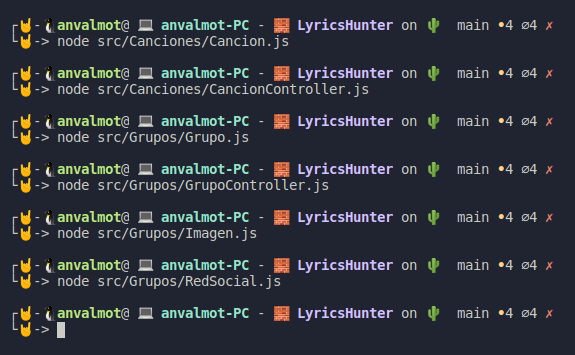

## Clases creadas

Para este proyecto se han definido inicialmente dos clases. 

1. La clase Artista, la cual se encuentra en el fichero [Artista.js](../src/Artista.js).
2. La clase Canción, la cual se encuentra en el fichero [Cancion.js](../src/Cancion.js).

Cada una de estas clases, será el núcleo de cada uno de sus respectivos microservicios.

Como prueba de que ambas clases son sintácticamente correctas, se adjunta la siguiente imagen:

