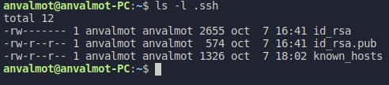
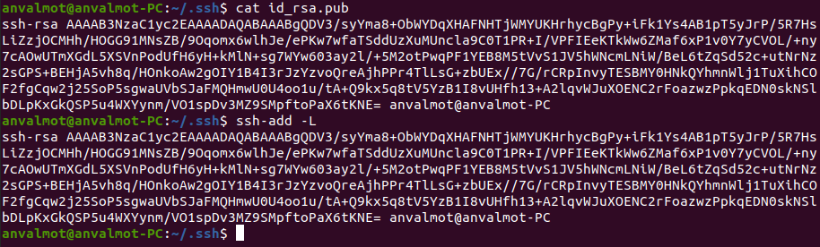
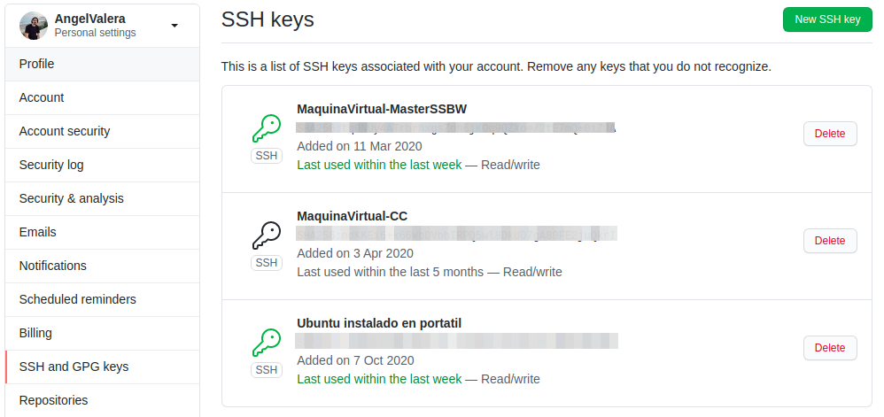
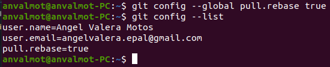
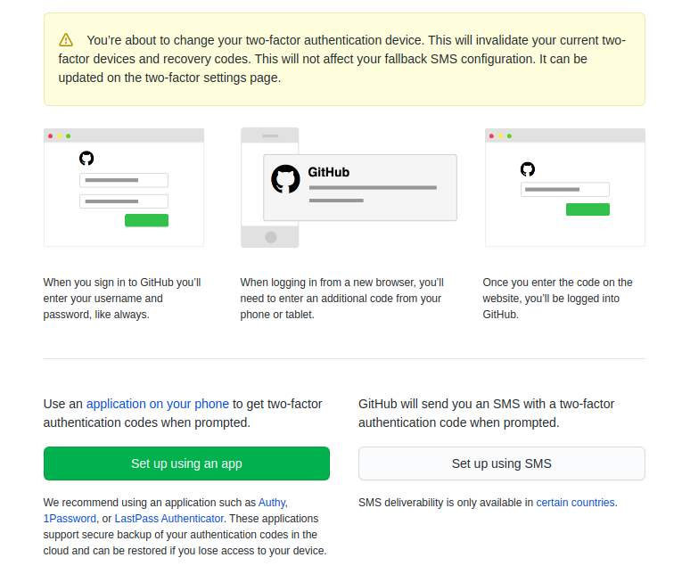
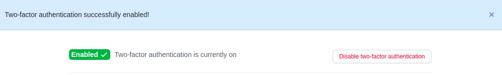
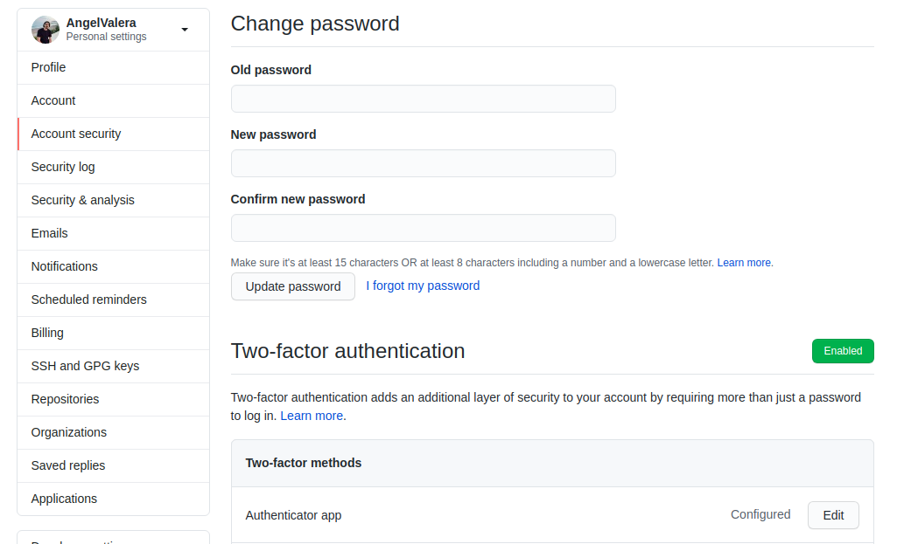

## Configuración inicial del repositorio 

En este documento se va a recoger cómo se ha configurado el entorno de trabajo para empezar a trabajar en este proyecto. 

En primer lugar, se va a realizar una breve descripción de los repositorios que serán utilizados durante el desarrollo de este proyecto. Posteriormente, se describe cómo se han generado el par de claves y la subida de la clave pública a Github. A continuación, se recogerá como se ha configurado git y cómo se ha editado el perfil de Github y por último, se recoge cómo se ha aumentado la seguridad en la cuenta de Github, activando el segundo factor de seguridad.

### Creación de los repositorios

Para el desarrollo de este proyecto a lo largo del curso de la asignatura de Cloud Computing I, será necesario utilizar tres repositorios, los cuales quedan descritos y enlazados a continuación:

* [Repositorio fork de la asignatura](https://github.com/AngelValera/CC-20-21) : En este repositorio se irán subiendo los objetivos semanales además de realizar las entregas pertinentes. 
* [Repositorio del proyecto](hhttps://github.com/AngelValera/LyricsHunter) : En este repositorio se irá desarrollando el proyecto completo que será necesario para superar la asignatura.
* [Repositorio de ejercicios de autoevaluación](https://github.com/AngelValera/CC2021-Ejercicios) : En este repositorio se irán realizando los ejercicios de autoevaluación de cada uno de los temas de la asignatura.

### Creación del par de claves y subida de la clave pública a GitHub

Para evitar tener que introducir las credenciales de nuestra cuenta en Github, debemos crear un par de claves, una pública y otra privada en nuestro equipo y después agregar la clave pública generada a nuestra cuenta de Github. El proceso que se ha seguido para crear estas claves viene descrito en este [enlace](https://docs.github.com/en/free-pro-team@latest/github/authenticating-to-github/generating-a-new-ssh-key-and-adding-it-to-the-ssh-agent).

En la siguiente imagen podemos comprobar que efectivamente tenemos en nuestro equipo tanto el directorio ssh como el par de claves generadas, así como el fichero con los host permitidos en nuestro equipo.

La clave pública se encuentra en el fichero id_rsa.pub y debemos tenerla agregada también a nuestro agente ssh.

Finalmente, agregamos también la clave pública a nuestro perfil de Github, tal y como se puede ver en la siguiente imagen. 

En este caso, la clave agregada corresponde a la que tiene por nombre "Ubuntu instalado en portatil".

### Configuración correcta de Git

Para tener correctamente configurada nuestra instalación de Git local, debemos hacer uso del comando `git config --global` e indicarle tanto nuestro nombre como nuestro email por defecto. Otra opción por defecto que se ha configurado ha sido que al hacer uso del comando `git pull` siempre sea con la opción `--rebase`. Finalmente, la configuración quedaría de la siguiente forma:

### Edición del perfil de GitHub 

Por otro lado, había que configurar correctamente nuestro perfil en Github para que aparezca una imagen, el nombre completo, la ciudad y la universidad.

### Incrementar la seguridad de la cuenta de GitHub

Por último, debemos incrementar la seguridad de nuestra cuenta de Github. Para ello habilitaremos un método de autenticación de dos factores. Para esto habría que ir a las opciones de "Account Security" y habilitar la opción de "Two-factor authentication". A partir de aquí debemos escoger el tipo de autentificación en dos pasos que queremos tal y como aparece en la siguiente imagen:

En mi caso utilicé la aplicación Authy tal y como recomienda, y después de seguir los pasos que se indican en la aplicación, la autentificación en dos pasos en mi cuenta de Github quedó correctamente configurada.

