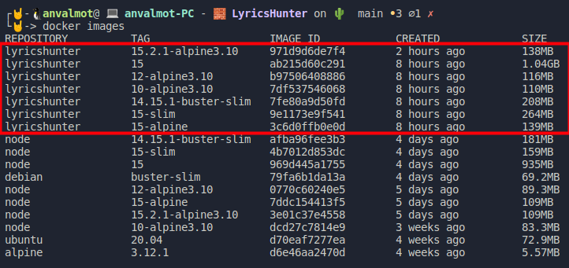
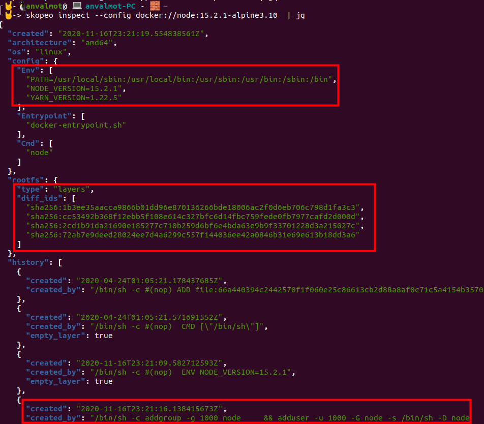

## Elección correcta y justificada de la imagen base del contenedor

### Estudio teórico previo

Cuando se necesita crear un contenedor lo primero que se debe hacer es elegir un sistema base. Existen numerosas alternativas y hay que tener en cuenta una serie de propiedades a la hora de escoger entre una imagen u otra. 

Algunas de estas propiedades son:
- Comprobar si hay una imagen oficial para lo que queremos hacer.
- Determinar el tamaño inicial de la imagen que hemos escogido.
- Determinar el número de capas de la imagen.
- Determinar el sistema de archivos que la imagen utiliza.
- Determinar si la imagen escogida utiliza apt, apk, dnf, yum, etc.
- Determinar si tiene implementada la biblioteca de C, glibc o musl libc u otra.

Para ayudarnos a la hora de analizar las imágenes podemos hacer uso de algunas herramientas como son [Skopeo](https://github.com/containers/skopeo) y [Container-diff](https://github.com/GoogleContainerTools/container-diff).

Otro aspecto a tener en cuenta a la hora de elegir una imagen base, sobre todo si no se trata de una imagen con un sistema operativo "limpio", es elegir entre las diferentes etiquetas que se nos proporciona. Podemos encontrar etiquetas con Alpine, Slim, Stretch, Buster, Jessie o Bullseye. La principal diferencia entre una u otra es el sistema operativo que están usando esas imágenes como base. En resumen, como se indica en esta [página](https://medium.com/swlh/alpine-slim-stretch-buster-jessie-bullseye-bookworm-what-are-the-differences-in-docker-62171ed4531d), podemos encontrarno con los siguientes tipos:

- **Imagen completa oficial**: Por lo general, estas imágenes utilizan como sistema operativo base la versión más estable de Debian y por lo general, si el espacio no es un problema es la que se debería usar por defecto ya que es la más completa y segura.
- **Strech**: Las imágenes con esta etiqueta se basan en la versión 10 de Debian.
- **Buster**: Las imágenes con esta etiqueta se basan en la versión 9 de Debian.
- **Jessie**: Las imágenes con esta etiqueta se basan en la versión 8 de Debian.
- **Bullseye**: Las imágenes con esta etiqueta utilizan una versión posterior a Buster, aunque hoy día se encuentra en pruebas.
- **Slim**: Las imágenes con esta etiqueta utilizan una versión minimizada de Debian, esto es, utilizan solamente los paquetes necesarios para una herramienta en particular. esto hace que la imagen generada tenga un menor tamaño.
- **Alpine**: Las imágenes de Alpine se basan en Alpine Linux Project, que es un sistema operativo que se creó específicamente para su uso dentro de contenedores. La principal ventaja de alpine es que permite crear imágenes con un tamaño muy pequeño, sin embargo, hay que ser consciente que al usarla pueden aparecer ciertos problemas ya que no contiene algunos paquetes que se podrían necesitar y además, utiliza musl libc, en lugar de glibc que es más pesado. Esto puede hacer que haya problemas si su aplicación tiene requisitos específicos de libc. otra diferencia respecto a las imágenes anteriores es que utiliza apk en lugar de apt para instalar paquetes.

### Elección

Una vez que tenemos claro, las diferencias entre los distintos tipos de imágenes, lo que vamos a hacer es seleccionar una serie de imágenes base, las cuales compararemos y finalmente determinaremos con qué imagen nos quedamos como imagen base para nuestro contenedor:

En un primer momento, se pensó en escoger una imagen con un sistema operativo base limpio, de entre los siguientes:

- **ubuntu:20.04**: Porque  es el sistema operativo que utilizo en mi máquina.
- **debian:buster-slim**: Porque Debian es de las imágenes base más utilizadas.
- **alpine:3.12.1**: Porque es el sistema base con el menor tamaño.

Sin embargo, estas opciones fueron descartadas, debido principalmente a que mi proyecto utiliza Node.js, y una cosa que se aconseja a la hora de escoger una imagen base, es determinar si hay alguien que ya haya definido un contenedor con lo que se necesita y comprobar si nos sirve, y sobre todo si ese alguien es una fuente oficial. Por tanto, para Node.js encontramos en [Docker Hub](https://hub.docker.com/_/node) varias imágenes oficiales que se supone que han sido construidas siguiendo buenas prácticas y que estas imágenes han sido comprobadas y testeadas. Vamos a escoger varias de estas imágenes y comprobar sobre todo su tamaño y si utilizando estas imágenes nuestro contenedor funciona.

- **node:10-alpine3.10**: 
- **node:12-alpine3.10**:
- **node:14.15.1-buster-slim**:
- **node:15**:
- **node:15-slim**:
- **node:15-alpine**:
- **node:15.2.1-alpine3.10**:

Estas imágenes se han elegido con una versión de Node específica, ya que en las guías de buenas prácticas, se desaconseja dejar la etiqueta `latest` ya que esta siempre coge la última versión y esta cambia con el tiempo. 

Las versiones de node que se han elegido han sido la 15, porque en la página de [Node.js](https://nodejs.org/es/) se indica que es la versión actual. La 14 porque es la versión LTS a día de hoy y se recomienda para la mayoría y finalmente las versiones alpine de Node 10 y Node 12 para comprobar otras versiones un poco más antiguas.

Una vez elegidas las imágenes candidatas, se desarrolló el fichero [Dockerfile](../Dockerfile), cuya construcción se datalla en este [fichero](Creacion_Dockerfile.md).

Este dockerfile se ha ejecutado con cada una de las imágenes base anteriores, para comprobar el tamaño de las nuevas imágenes, podemos usar `docker images` o la herramienta `Container-diff`:

Usando Container-diff:

* `container-diff analyze  --type=size`

Usando docker images: 

Como se puede ver, la versión que más tamaño ha tenido ha sido la versión base de `node:15`, con 1.04 GB, lo que resulta excesivo y por tanto se ha descartado.

La que menor tamaño ha generado ha sido la versión de `node:10-alpine3.10`, seguida por la versión `node:12-alpine3.10`, sin embargo al ser versiones un poco antiguas serán descartadas.

en cuanto a las versiones `node:15.2.1-alpine3.10` y la `node:15-alpine`, no hay mucha diferencia, por lo que nos quedaremos con la versión más actual. 

Llegados hasta aquí, tendíamos que elegir entre las siguientes versiones:

- **node:14.15.1-buster-slim**:
- **node:15-slim**:
- **node:15.2.1-alpine3.10**:

En cuanto a los tamaños, la más pequeña es la versión alpine, por lo que posicionaría como mi primera elección, pero antes usaremos la herramienta Skopeo junto a JQ, para ver qué contiene esta imagen que nos pueda interesar.

* `skopeo inspect --config docker://node:15.2.1-alpine3.10  | jq`

Como se puede ver en la anterior captura, usando como imagen `node:15.2.1-alpine3.10` dispondremos de 3 variables de entorno y un usuario llamado `node` que no tiene privilegios de administrador, lo cual no resulta muy útil a la hora de crear nuestro contenedor.

Por último podemo ver que consta de solamente 4 capas, aunque éstas pasan a ser 9 cuando generamos nuestro contenedor.

Después de comprobar el contenido de `node:15-slim` y `node:14.15.1-buster-slim` salvo por el número de capas que tienen 5 cada una, cuentan con lo mismo que la imagen `node:15.2.1-alpine3.10`.

Por tanto, después de ver y valorar las distintas opciones he decidido usar como imagen base de mi contenedor **node:15.2.1-alpine3.10** que además de las razones anteriores se suma que es la versión de node que estoy utilizando para desarrollar el proyecto.

---
#### Referencias:

[Alpine, Slim, Stretch, Buster, Jessie, Bullseye — What are the Differences in Docker Images?](https://medium.com/swlh/alpine-slim-stretch-buster-jessie-bullseye-bookworm-what-are-the-differences-in-docker-62171ed4531d)

[Skopeo](https://github.com/containers/skopeo)

[docker: how to show the diffs between 2 images](https://stackoverflow.com/questions/21200304/docker-how-to-show-the-diffs-between-2-images)

[Musl libc](https://es.wikipedia.org/wiki/Musl)

[Glibc](https://es.wikipedia.org/wiki/Glibc)