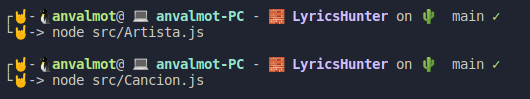

## Clases creadas

Para este proyecto se han definido de esta manera:

* src
  * Canciones
    * [Cancion.js](../../src/Canciones/Cancion.js)
    * [CancionController.js](../../src/Canciones/CancionController.js)
  * Grupos
    * [Grupo.js](../../src/Grupos/Grupo.js)
    * [GrupoController.js](../../src/Grupos/GrupoController.js)
    * [Imagen.js](../../src/Grupos/Imagen.js)
    * [RedSocial.js](../../src/Grupos/RedSocial.js)

Como prueba de que ambas clases son sintácticamente correctas, se adjunta la siguiente imagen:

