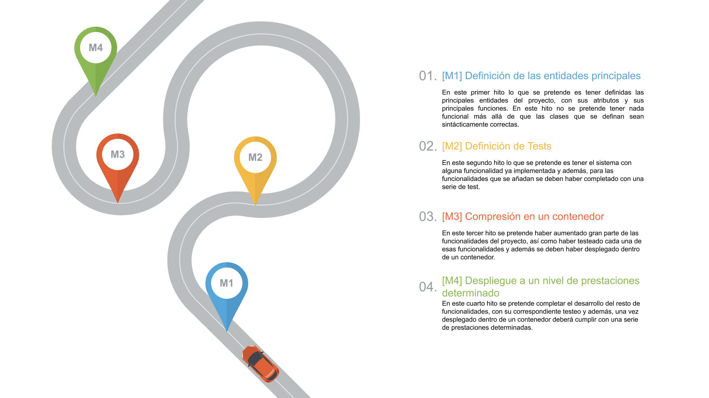

## Planificación del proyecto

En cuanto a la planificación del proyecto, lo que se ha hecho a sido definir una serie de historias de usuario, las cuales se han agrupado en cuatro milestones, de manera que para cada uno de ellos, tengamos una versión mínimamente funcional del proyecto. 

Dentro de cada milestone, se han definido una serie de Historias de Usuario y de subtareas que se irán realizando durante el desarrollo de este proyecto.

### RoadMap

[PowerPoint Presentation Template by HiSlide.io](https://www.hislide.io)

#### [M1] Definición de las entidades principales

En este primer hito lo que se pretende es tener definidas las principales entidades del proyecto, con sus atributos y sus principales funciones. En este hito no se pretende tener nada funcional más allá de que las clases que se definan sean sintácticamente correctas.

* **[[M1] Definición de las entidades principales](https://github.com/AngelValera/LyricsHunter/milestone/3)** 🏁
  

#### [M2] Definición de Tests

En este segundo hito lo que se pretende es tener el sistema con alguna funcionalidad ya implementada y además, para las funcionalidades que se añadan se deben haber completado con una serie de test.

Para llevarlo a cabo se han designado las siguientes de Historias de Usuario y de tareas.

* **[[M2] Definición de Tests](https://github.com/AngelValera/LyricsHunter/milestone/6)** 🏁
  
#### [M3] Compresión en un contenedor

En este tercer hito se pretende haber aumentado gran parte de las funcionalidades del proyecto, así como haber testeado cada una de esas funcionalidades y además se deben haber desplegado dentro de un contenedor.

* **[[M3] Compresión en un contenedor](https://github.com/AngelValera/LyricsHunter/milestone/7)** 🏁
  

#### [M4] Despliegue a un nivel de prestaciones determinado

En este cuarto hito se pretende completar el desarrollo del resto de funcionalidades, con su correspondiente testeo y además, una vez desplegado dentro de un contenedor deberá cumplir con una serie de prestaciones determinadas.

* **[[M4] Despliegue a un nivel de prestaciones determinado](https://github.com/AngelValera/LyricsHunter/milestone/8)** 🏁 
  

#### Adicional

Para ayudar a la hora de planificarse el trabajo se ha definido un [Projects](https://github.com/AngelValera/LyricsHunter/projects/1) desde github, de manera que se pueda ir marcando como pendientes, en desarrollo o completadas, tanto las tareas como las historias de usuario definidas.

