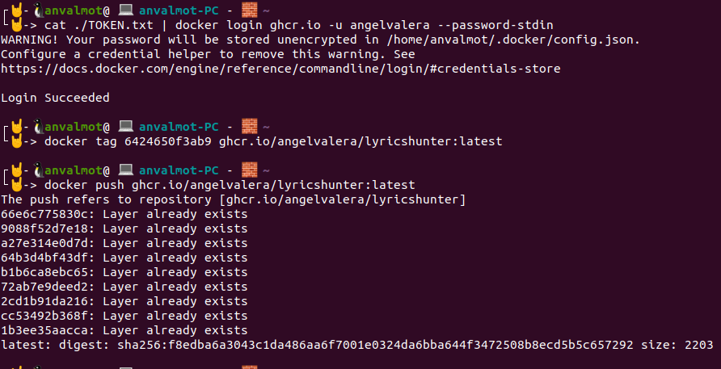

## Subida del contenedor al Github Container Registry

Para poder subir nuestro contenedor al repositorio de github, llamado Github Container Registry, lo que debemos hacer es lo siguiente:

En primer lugar debemos crearnos un personal access token, tal y como se indica en este [enlace](https://docs.github.com/es/free-pro-team@latest/github/authenticating-to-github/creating-a-personal-access-token).

Una vez creado, deberíamos tener algo como lo que se puede ver en la siguiente captura:


El siguiente paso es habilitar desde `new features` la opción de `Improved container support`.


### Github Docker Images

El siguiente paso es subir nuestra imagen a Github Docker images. Para ello se ha seguido con lo que se indica en esta [página](https://docs.github.com/es/free-pro-team@latest/packages/using-github-packages-with-your-projects-ecosystem/configuring-docker-for-use-with-github-packages). 

Una vez que tenemos creado el Token, lo podemos guardar en una variable de entorno o en un fichero de manera que podamos utilizarlo para loguearnos dentro de Docker images y poder subir una imagen de docker.

Con el siguiente comando nos logueamos en Docker Images:
- `$ cat ~/TOKEN.txt | docker login https://docker.pkg.github.com -u USERNAME --password-stdin`
Con el siguiente comando creamos una nueva etiqueta para la imagen que le indiquemos:
- `$ docker tag IMAGE_ID docker.pkg.github.com/OWNER/REPOSITORY/IMAGE_NAME:VERSION`

Con el siguiente comando publicaremos esa imagen dentro de Docker images.
- `$ docker push docker.pkg.github.com/OWNER/REPOSITORY/IMAGE_NAME:VERSION`

En mi caso la secuencia de instrucciones que se han introducido ha sido la siguiente:

* `$ cat ~/TOKEN.txt | docker login https://docker.pkg.github.com -u angelvalera --password-stdin`

* `$ docker tag 6424650f3ab9 docker.pkg.github.com/angelvalera/lyricshunter/lyricshunter:latest`

* `$ docker push docker.pkg.github.com/angelvalera/lyricshunter/lyricshunter:latest`


Con esto, ya tendríamos la imagen subida a Docker Images y nos aparecería en el repositorio del poyecto. Se puede acceder a esta imagen desde este [enlace](https://github.com/AngelValera/LyricsHunter/packages/513671).

### Github Container Registry

Por otro lado, dado que el registro Docker de Paquetes de GitHub será reemplazado por GitHub Container Registry, vamos a subir la imagen también a Github Container Registry, para ello los comandos a introducir son muy similares a los anteriores, con la salvedad de que ahora el dominio ha cambiado de `docker.pkg.github.com` a `ghcr.io`. Como se indica en esta [página](https://docs.github.com/es/free-pro-team@latest/packages/managing-container-images-with-github-container-registry/connecting-a-repository-to-a-container-image#connecting-a-repository-to-a-container-image-on-the-command-line) la secuencia de comandos a introducir sería la siguiente:

Para loguearnos dentro de Github Container Registry usando el Personal Access Token que posteriormente creamos.
* `$ echo $CR_PAT | docker login ghcr.io -u USERNAME --password-stdin`

Para asignar una nueva eqtiqueta a la imagen que queramos subir.
* `$ docker tag IMAGE_NAME ghcr.io/OWNER/NEW_IMAGE_NAME:TAG`

Para subir la imagen:
* `$ docker push ghcr.io/OWNER/IMAGE-NAME:TAG`

Además para conectar la imagen con el repositorio de manera automática deberíamos añadir la siguiente línea a nuestro Dokcerfile:

`LABEL org.opencontainers.image.source https://github.com/angelvalera/lyricshunter`

En mi caso la secuencia de comandos introducidos ha sido la siguiente:

* `$ cat ./TOKEN.txt | docker login ghcr.io -u angelvalera --password-stdin`
* `$ docker tag 6424650f3ab9 ghcr.io/angelvalera/lyricshunter:latest`
* `$ docker push ghcr.io/angelvalera/lyricshunter:latest`



Con esto ya tendríamos la imagen subida, sin embargo estaría como un registro privado. Deberíamos acceder a este registro desde el apartado `Packages` e indicarle que es un registro público:


Además de indicarle los permisos que necesitamos usar de dicho registro:


Ahora el registro estaría listo y accesible desde este [enlace](https://github.com/users/AngelValera/packages/container/package/lyricshunter).


Por último, podemos ver desde el repositorio ambas imágenes creadas.


### Github Action

Vamos a definir una Github Action para actualizar este registro de manera automática con cada push. Para esto, lo primero será crear un nuevo secrets en el repositorio con el Token que generamos anteriormente.


Cuando entramos por primera vez en la sección de Actions, aparecen recomendaciones y ejemplos de actions que poodemos usar. Para generar esta action, se tomó como ejemplo la action de [Publish Docker Container](https://github.com/actions/starter-workflows/blob/2d3a2e57d3052cb97d2f78f589d60326bd2bbc50/ci/docker-publish.yml) que proporciona Github.

```yml
name: Auto-Publish-GCR

# When is activated
on:
  # When pushing to the repository
  push:
    # Only considers "main" branch
    branches:
      - main

    # Publish "v1.2.3" tags as releases
    tags:
      - v*
    # Triggers only with this path
    paths:
      - 'Dockerfile'
      - 'Gruntfile.js'
      - '.jshintrc'

# Jobs to do
jobs:
  # Push of the docker image
  push:
    # Detect on ubuntu the "push" event
    runs-on: ubuntu-latest
    if: github.event_name == 'push'

    # Steps of the job
    steps:
      # Checks-out repository under $GITHUB_WORKSPACE, so workflow can access it
      - uses: actions/checkout@v2

      # Build the image in local space
      - name: Build image
        run: docker build -t lyricshunter .

      # Log into Github Container using secrets
      - name: Log into GitHub Container Registry
        run: echo "${{ secrets.MY_PERSONAL_ACCESS_TOKEN }}" | docker login ghcr.io -u angelvalera --password-stdin

      # Push the image to the repository
      - name: Push image
        run: |
          # Image on Github Container Registry
          IMAGE_ID=ghcr.io/angelvalera/lyricshunter
          
          # Strip git ref prefix from version
          VERSION=$(echo "${{ github.ref }}" | sed -e 's,.*/\(.*\),\1,')
          
          # Strip "v" prefix from tag name
          [[ "${{ github.ref }}" == "refs/tags/"* ]] && VERSION=$(echo $VERSION | sed -e 's/^v//')
          
          # Use Docker `latest` tag convention
          [ "$VERSION" == "main" ] && VERSION=latest
          echo IMAGE_ID=$IMAGE_ID
          echo VERSION=$VERSION
          
          # Tag of the image
          docker tag lyricshunter $IMAGE_ID:$VERSION
          
          # Push the image
          docker push $IMAGE_ID:$VERSION

```
Hecho esto cuando hagamos algún push en el repositorio, la action actuará y actualizará la imagen:


---
#### Referencias:

[Connecting a repository to a container image](https://docs.github.com/en/free-pro-team@latest/packages/managing-container-images-with-github-container-registry/connecting-a-repository-to-a-container-image)

[Enabling improved container support](https://docs.github.com/en/free-pro-team@latest/packages/getting-started-with-github-container-registry/enabling-improved-container-support)

[Configuring Docker for use with GitHub Packages](https://docs.github.com/es/free-pro-team@latest/packages/using-github-packages-with-your-projects-ecosystem/configuring-docker-for-use-with-github-packages)


[Migrating to GitHub Container Registry for Docker images](https://docs.github.com/es/free-pro-team@latest/packages/getting-started-with-github-container-registry/migrating-to-github-container-registry-for-docker-images)

[Docker Support for the New GitHub Container Registry](https://www.docker.com/blog/docker-support-for-the-new-github-container-registry/)

[Learn GitHub Actions](https://docs.github.com/en/free-pro-team@latest/actions/learn-github-actions)