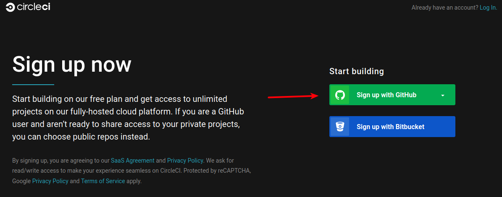
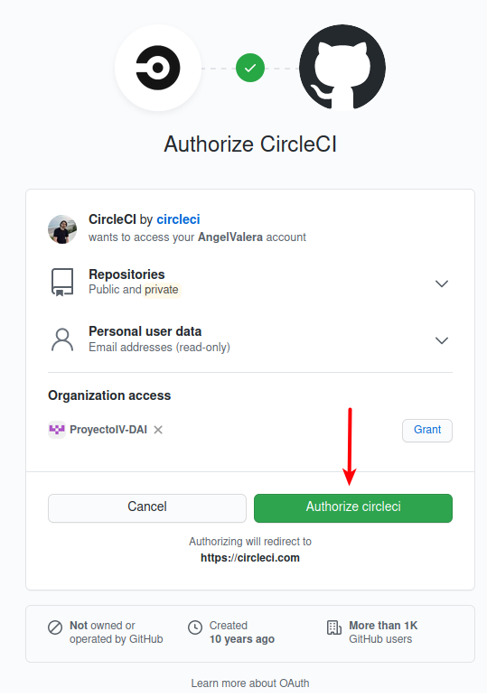
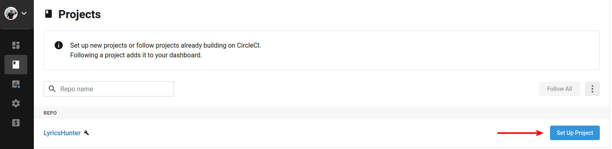
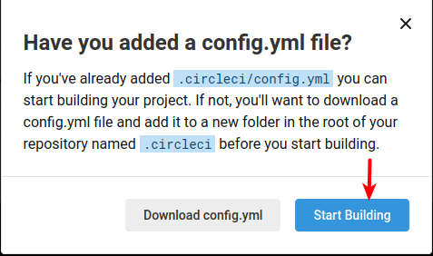
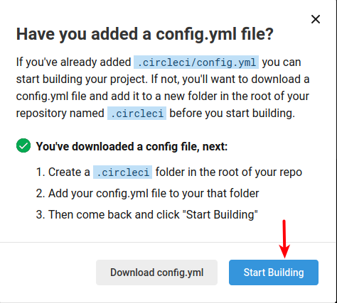
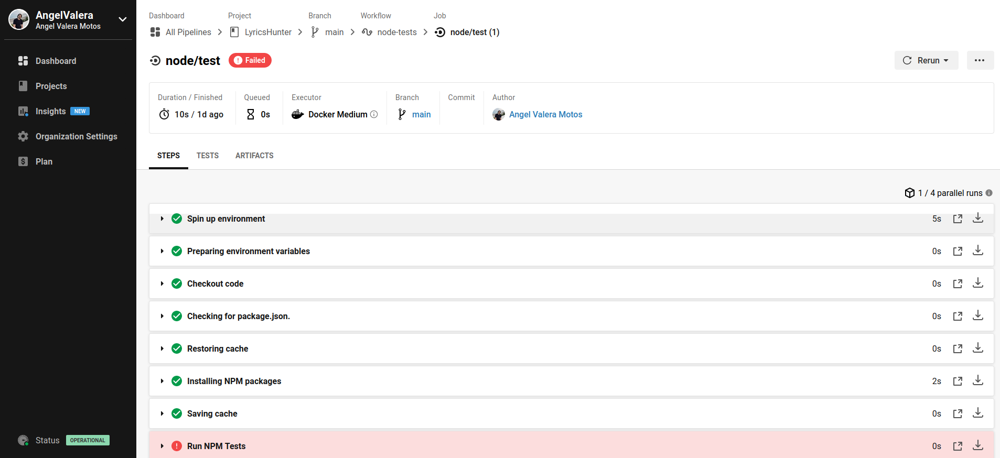
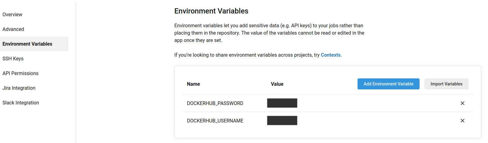
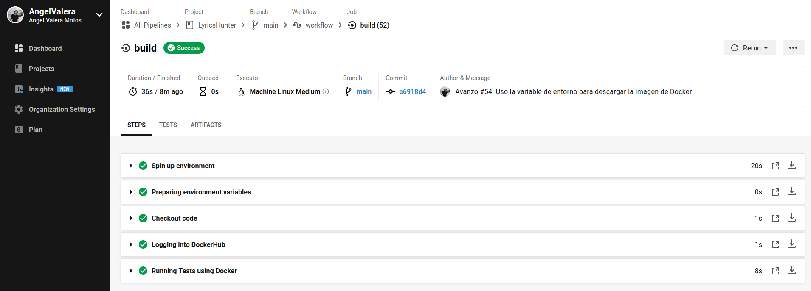
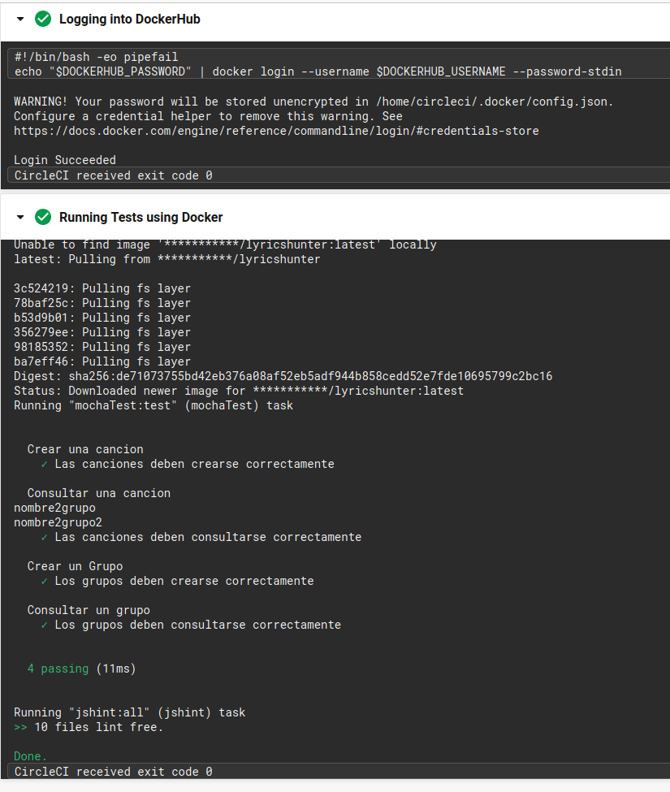

## Configuración y justificación de un sistema adicional de CI

- [Configuración y justificación de un sistema adicional de CI](#configuración-y-justificación-de-un-sistema-adicional-de-ci)
  - [CircleCI](#circleci)
      - [Elección](#elección)
      - [Configuración](#configuración)
      - [Justificación](#justificación)
  - [Github Actions](#github-actions)
    - [Referencias:](#referencias)

### CircleCI

##### Elección

Como sistema adicional de integración continua, después de valorar otras opciones finalmente me he decidido por utilizar [Circle CI](https://circleci.com/).

El principal motivo es que resulta muy fácil de integrar a nuestro repositorio en Github, además de contar con varios ejemplos y bastante documentación, lo cual facilita bastante el empezar a trabajar con este sistema. Además dispone de 2500 créditos para usar gratuitamente.

CircleCI ejecuta casi un millón de trabajos por día en apoyo de 30.000 organizaciones. Esto se debe a que los trabajos se ejecutan rápidamente en gran parte a que te permite que los trabajos puedan ser optimizados en gran medida.

Otro punto a favor, y que en particular, a mi me ha servido bastante es la de poder conectarte a un contenedor o máquina virtual mediante SSH y poder depurar el flujo de trabajo si este falla (Aunque en mi caso también me ha servido para consumir casi todos los créditos gratuitos sin querer).

Finalmente, otro motivo por el que he decidido escoger Circle Ci es por la gran cantidad de publicidad que veo de ellos cuando navego, por lo que he decidido porbar de primera mano si de verdad merecen tanta publicidad.

##### Configuración

Para configurar nuestro repositorio de Github con Circle Ci, lo primero que debemos hacer es registrarnos. Como se ve en la siguiente captura podemos hacerlo directamente con nuestra cuenta de Github.



El siguiente paso sería, autorizar el acceso a nuestra cuenta de Github.



Una vez autorizado, ya podremos ver desde el dashboard que proporciona CircleCI, todos nuestros repositorios.




Una vez seleccionado el repositorio que queremos configurar, haciendo click en `Set up Project`. Esto hará que Circle CI examine el contenido de dicho repositorio y recomiende un primer fichero de configuración. Nos ofrecerá incluirla directamente a nuestro repositorio o bien descargar dicho fichero generado por defecto para que lo agreguemos nostros manualmente:



En mi caso, eso fue lo que hice, descargué este primer fichero y lo agregué a mi repositorio. Se puede ver en el siguiente [commit](https://github.com/AngelValera/LyricsHunter/commit/4281e7f4086b49fb4e2c69041207d7b29a21795c).

Una vez agregado, volvemos a CircleCI para indicarle que comience a ejecutar ese fichero que acabamos de añadir:



Con esto, ya tendríamos correctamente configurado y funcionando CircleCI, en nuestro repositorio.



Como se ha podido comprobar en la captura anterior, aunque CircleCi, está correctamente configurado y enlazado con nuestro repositorio, el resultado de la ejecución de ese primer fichero recomendado que nos ofreció Circle CI no ha sido satisfactorio. 

##### Justificación


A continuación, explicaremos cómo se ha configurado Circle Ci, no solo para que consiga ejecutar los test, si no que además haga uso de la [imagen](https://hub.docker.com/r/angelvalera/lyricshunter) del contenedor que creamos en hitos anteriores.

El fichero [config.yml](../../.circleci/config.yml), finalmente quedaría de la siguiente manera:

```yml
version: 2.1
jobs:
  build:
    machine: 
      image: ubuntu-2004:202010-01
    steps:
      - checkout
      # Loggin into DockerHub
      - run: 
          name: Logging into DockerHub
          command: | 
            echo "$DOCKERHUB_PASSWORD" | docker login --username $DOCKERHUB_USERNAME --password-stdin         

      # Running Tests using Docker
      - run:
          name: Running Tests using Docker
          command: | 
            docker run -t -v `pwd`:/app/test $DOCKERHUB_USERNAME/lyricshunter
```
La base sobre la que desarrollé esta solución se puede encontrar en el siguiente [enlace](https://circleci.com/docs/2.0/building-docker-images/).

La idea era copiar nuestro repositorio que contiene tanto test como código fuente y pasarselo a la imagen de dockerhub que definimos en el hito anterior. De esta forma, no habría que volver a instalar las depedencias ni el gestor de tareas, ya que irían ya instaladas en dicha imagen. A diferencia de la configuración en Travis, en este caso no realizamos pruebas sobre distintas versiones de node, ya que la imagen base de mi contenedor usaba la versión 15 de node (node:15.2.1-alpine3.10) y ésta no fue probada en Travis precisamente para ser probada directamente desde el contenedor.

En la siguiente línea establecemos la versión que queremos utilizar. En mi caso utilizo la versión 2.1 que es a día de hoy la más reciente. Este campo está destinado a ser utilizado para emitir advertencias por deprecación o cambios importantes.

```yml
version: 2.1
```

En las siguientes líneas, definimos los diferentes trabajos, y para ello hacemos uso de `jobs`. El primer trabajo establecido es `build` y en ese trabajo primero definimos la máquina virtual que queremos utilizar. En mi caso he utilizado `ubuntu-2004:202010-01`, la cual trae instalados Ubuntu 20.04, Docker v19.03.13 y Docker Compose v1.27.4

```yml
jobs:
  build:
    machine: 
      image: ubuntu-2004:202010-01
```

En las siguientes líneas definimos una serie de pasos que el trabajo debe realizar para poder completarse, para ello usamos `steps`:

```yml
    steps:
```
En el primer paso, usamos `checkout` para descargarnos el contenido del repositorio dentro de la imagen de la máquina virtual.

```yml
    steps:
      - checkout      
```
En el segundo paso, hacemos que se identifique con nuestras credenciales en DockerHub.para esto hacemos uso de  `run` al cual establecemos un nombre con `name` y el comando a ejecutar con `command`.

```yml    
      # Loggin into DockerHub
      - run: 
          name: Logging into DockerHub
          command: | 
            echo "$DOCKERHUB_PASSWORD" | docker login --username $DOCKERHUB_USERNAME --password-stdin
```
Estas credenciales han sido previamente almacenadas en el proyecto como variables de entorno.



En el último paso, ejecutamos la imagen del contenedor. Para esto, de igual forma que en el paso anterior, hacemos uso de `run`, `name` y `command`. A este último, le pasamos el siguiente comando:

```shell
    docker run -t -v `pwd`:/app/test $DOCKERHUB_USERNAME/lyricshunter
```
En el comando anterior creamos un volumen a través del cual pasamos el contenido del repositorio dentro del contenedor. Este contenedor, como ya tiene instaladas previamente las dependencias, no necesita nada más para ejecutarse:

```yml
      # Running Tests using Docker
      - run:
          name: Running Tests using Docker
          command: | 
            docker run -t -v `pwd`:/app/test $DOCKERHUB_USERNAME/lyricshunter
```

Una vez subido el nuevo fichero de configuración, si volvemos a CircleCI, podremos comprobar que efectivamente ha ejecutado los test y el código los ha pasado.





Finalmente, solo nos quedaría agregar al README de nuestro repositorio el badge correspondiente:

[](https://circleci.com/gh/AngelValera/LyricsHunter)


### Github Actions

Adicionalmente, he decidido añadir una Github Actions, al repositorio para hacer también integración continua. 

La idea es que dado que he consumido casi todos los creditos de CircleCi, para evitar que antes de finalizar este proyecto los acabe todos, tener otro sistema que funcione de manera similar.

Por tanto, esta actions funcionará de manera similar a la de Travis, pero ejecutando una versión distinta, hasta que CircleCi se agote.

El [fichero](../../.github/workflows/node.js.yml) finalmente quedaría de la siguiente manera:

```yml
# This workflow will do a clean install of node dependencies and run tests across different versions of node
# For more information see: https://help.github.com/actions/language-and-framework-guides/using-nodejs-with-github-actions

name: Node.js CI

on:
  push:
    branches: [ main ]
  pull_request:
    branches: [ main ]

jobs:
  build:

    runs-on: ubuntu-latest

    strategy:
      matrix:
        node-version: [[15.x]

    steps:
    - uses: actions/checkout@v2
    - name: Use Node.js ${{ matrix.node-version }}
      uses: actions/setup-node@v1
      with:
        node-version: ${{ matrix.node-version }}
    - run: npm install grunt-cli
    - run: grunt install
    - run: grunt test
```
Como base para ejecutar esta actions, se ha utilizado la que se propone como ejemplo, la cual se puede encontrar en el siguiente [enlace](https://github.com/actions/starter-workflows/blob/a571f2981ab5a22dfd9158f20646c2358db3654c/ci/node.js.yml).

En ella indicamos que se ejecute con cada push y pull_request sobre la rama principal, que utilice una imagen de Ubuntu y que use la versión 15 de node.js. 

La única diferencia es que se utiliza el gestor de tareas para instalar las dependencias y para ejecutar los test, de igual manera que con Travis.

Cuando en Circle Ci, se agoten los créditos, esta actions realizará la función que ahora hace Travis y Travis usará el contenedor tal y como ahora hace CircleCi.

Finalmente agregamos el badge al README.


---
#### Referencias:

[Overview CircleCI](https://circleci.com/docs/2.0/about-circleci/)

[Getting Started Introduction](https://circleci.com/docs/2.0/getting-started/#section=getting-started)

[Node.js - JavaScript Tutorial](https://circleci.com/docs/2.0/language-javascript/)

[circleci-demo-javascript-react-app - config.yml](https://app.circleci.com/pipelines/github/CircleCI-Public/circleci-demo-javascript-react-app/63/config)

[Adding Status Badges](https://circleci.com/docs/2.0/status-badges/)

[Migrating From Travis CI](https://circleci.com/docs/2.0/migrating-from-travis/#section=getting-started)

[Crear una acción de contenedor de Docker](https://docs.github.com/es/free-pro-team@latest/actions/creating-actions/creating-a-docker-container-action)

[Setting an environment variable in a project](https://circleci.com/docs/2.0/env-vars/#setting-an-environment-variable-in-a-project)

[Running Docker Commands](https://circleci.com/docs/2.0/building-docker-images/)

[Docker and CI/CD tutorial: a deep dive into containers](https://circleci.com/blog/docker-and-cicd-tutorial-a-deep-dive-into-containers/)

[Using CircleCI workflows to replicate Docker Hub automated builds](https://circleci.com/blog/using-circleci-workflows-to-replicate-docker-hub-automated-builds/)

[CircleCI Documentation](https://circleci.com/docs/2.0/#section=welcome)

[CircleCI Orbs](https://circleci.com/developer/orbs)

[Automate your Software Development with Docker and CircleCI](https://www.youtube.com/watch?v=15GYSxzdTLQ)

[Configuring CircleCI](https://circleci.com/docs/2.0/configuration-reference/#available-machine-images)