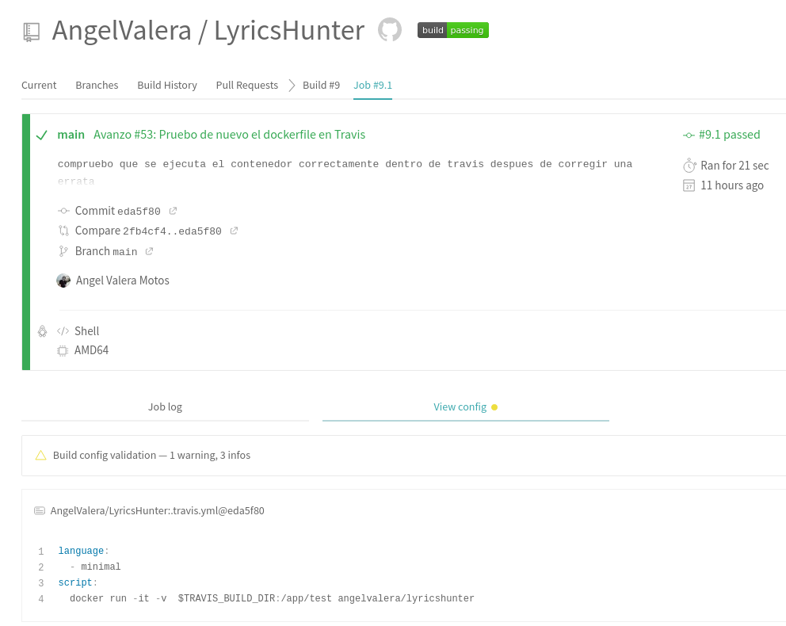
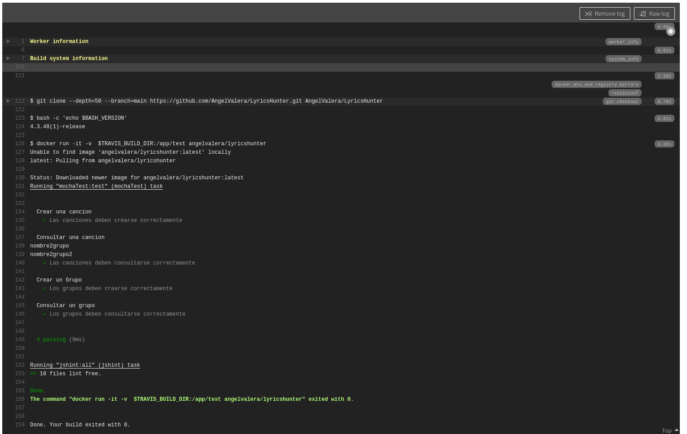
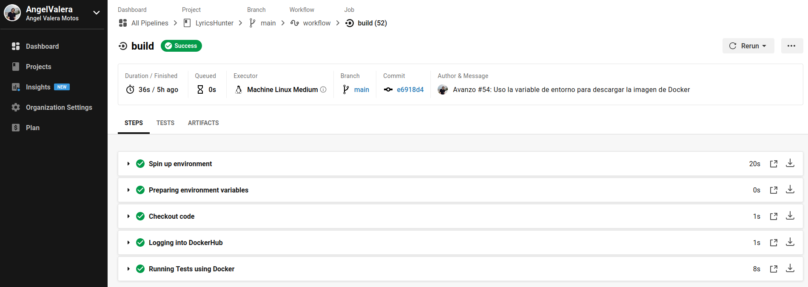
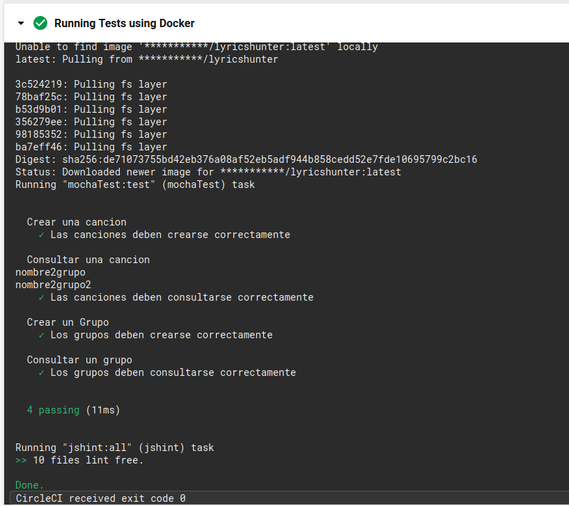

## Uso del contenedor de Docker en alguno de los sistemas de CI

Tal y como se pedía el contenedor creado en el hito anterior para ejecutar los test ha sido utilizado en alguno de los sistemas de integración continua. 

Aunque finalmente su uso se ha establecido para el sistema de integración CircleCI, también fue probado en TravisCI.

### TravisCI

Para probarlo en Travis, este fue el fichero .travis.yml con el que se realizó la prueba:

```yml
language:
  - minimal
script:
    docker run -it -v  $TRAVIS_BUILD_DIR:/app/test angelvalera/lyricshunter
```
Esto se puede comprobar en los siguientes commits:
- [eda5f80](https://github.com/AngelValera/LyricsHunter/commit/eda5f804dd053a30f220d933d2b6118f2ce71e75#diff-6ac3f79fc25d95cd1e3d51da53a4b21b939437392578a35ae8cd6d5366ca5485)
- [2fb4cf4](https://github.com/AngelValera/LyricsHunter/commit/2fb4cf40114e9e6d9df6ab554ddbf37ef0c848b5#diff-6ac3f79fc25d95cd1e3d51da53a4b21b939437392578a35ae8cd6d5366ca5485)

Y como se puede ver en las siguientes capturas, ejecutó y pasó correctamente los test:



En este caso, se utilizó una configuración de Travis que ejecutaba un lenguaje mínimal, que básicamente es shell ya que no era necesario nada más y hacía que se ejecutase un poco más rápido.

También hacemos uso de la variable de entorno de Travis `$TRAVIS_BUILD_DIR` para indicar al contenedor el directorio donde travis guarda los ficheros del repositorio y así poder acceder a los test y a los fuentes.

### CircleCI

Finalmente, como se puede ver en el fichero de configuración que hemos establecido para CircleCI, [config.yml](../../.circleci/config.yml),  hacemos uso del mismo [contenedor](https://hub.docker.com/r/angelvalera/lyricshunter) que en el caso anterior.

```yml
version: 2.1
jobs:
  build:
    machine: 
      image: ubuntu-2004:202010-01
    steps:
      - checkout
      # Loggin into DockerHub
      - run: 
          name: Logging into DockerHub
          command: | 
            echo "$DOCKERHUB_PASSWORD" | docker login --username $DOCKERHUB_USERNAME --password-stdin         

      # Running Tests using Docker
      - run:
          name: Running Tests using Docker
          command: | 
            docker run -t -v `pwd`:/app/test $DOCKERHUB_USERNAME/lyricshunter
```

En este caso, la única diferencia es que primero copiamos el contenido del repositorio a la máquina virtual y luego nos logueamos en Dockerhub para finalmente ejecutar los test usando el contenedor.

Como se puede ver, en ningún caso se ha instalado ninguna dependencia antes de ejecutar los test, pues ya están instaladas con anterioridad en dicho contenedor.


