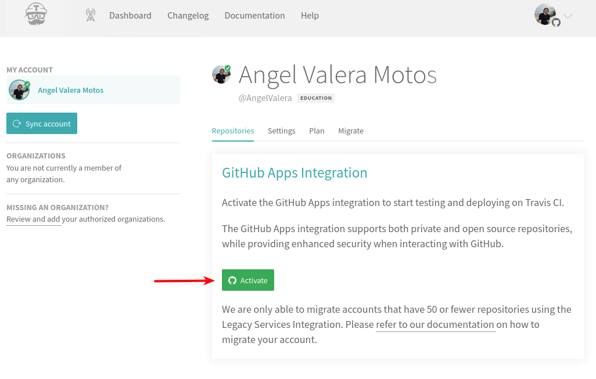
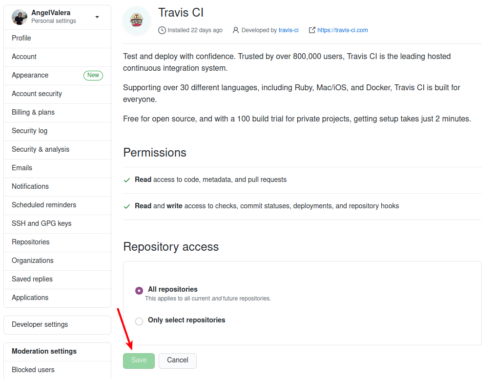
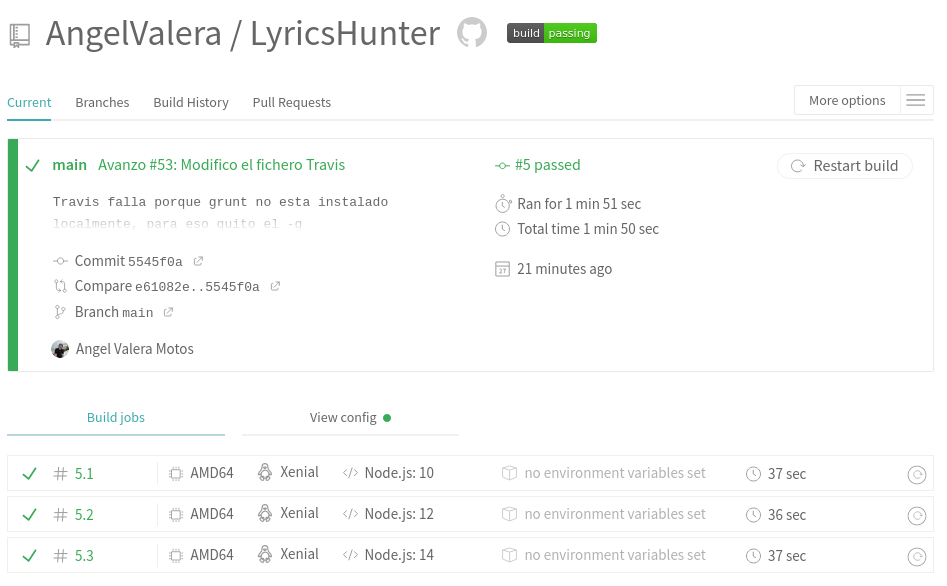
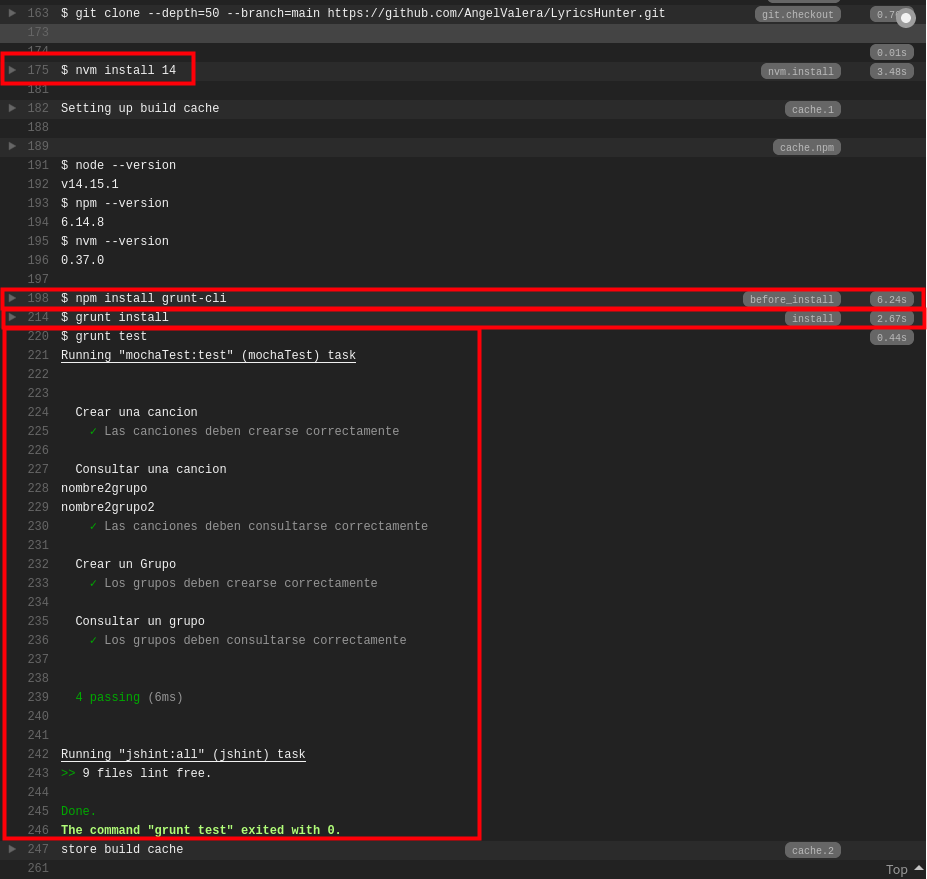

## Configuración y justificación del uso de Travis

### Configuración

Como primer sistema de integración contínua, se utilizará [Travis.ci](https://travis-ci.com/).

Para usar Travis, lo primero que debemos hacer es registrarnos. Dado que yo ya estaba registrado, lo único que tenía que hacer era indicar que se utilizase mi repositorio y crear un fichero llamado [.travis.yml](../../.travis.yml). 

Sin embargo, en mi caso al activar la versión para estudiantes de Github, se proporcionaban 10000 créditos para utilizar en Travis, con la diferencia de que yo estaba registrado en Travis.ci.org y con esta cuenta se nos daba acceso a Travis.ci.com. Por lo que he podido averiguar, Travis.ci.org era la versión de Travis para repositorios públicos mientras que Travis.ci.com era la versión de Travis para repositorios privados pero que desde 2018 se estaba permitiendo utilizar para los públicos ya que la otra versión dejará de funcionar el 31 de diciembre de 2020. 

Por tanto, decidí activar mi repositorio directamente en Travis.ci.com. Para ello di acceso a Travis a todos mis repositorios (aunque se podría dar acceso solo a los que nosotrpos decisdiesemos) de manera que él se encargará automáticamente de buscar en cada uno el fichero .travis.yml. 





Si ubiésemos configurado este repositorio desde Travis.ci.org, también se ofrece una utilidad de migración, pero en este caso no hizo falta.

Una vez creado el fichero .travis.yml correctamente, como se puede ver en la siguiente captura, Travis ya consigue ejecutarse y pasar los test. 

Como podemos comprobar en la siguiente captura, travis se ejecuta cada vez que se actualiza el repositorio si no se le indica lo contrario y podemos verlo desde el Dashboard que Travis proporciona.



### Justificación

Una vez que Travis está correctamente configurado, pasemos a explicar cómo se ha desarrollado el fichero [.travis.yml](../../.travis.yml) y porqué se ha desarrollado de esta manera.

```yml
language: node_js
node_js:
  - "10"
  - "12"
  - "14"
before_install:
  - npm install grunt-cli
install:
  - grunt install
script:
  - grunt test
```

Como se puede comprobar en la [documentación](https://docs.travis-ci.com/user/languages/javascript-with-nodejs/#nodejs-v4-or-iojs-v3-compiler-requirements) que travis proporciona para trabajar con proyectos en node.js, no hace falta darle muchas indicaciones a Travis para que él automáticamente ejecute los test. Sólamente habría que indicarle lo siguiente:

```yml
language: node_js
```
Si no indicamos nada más, Travis por defecto usará una versión de node, buscará si en el repositorio hay un package.json para instalar las dependencias y ejecutar los test.

Por tanto, partiendo de esa versión mínima, vamos a ir dándole a Travis más indicaciones. Para empezar, vamos a indicarle qué versiones queremos que ejecute. 

```yml
node_js:
  - "10"
  - "12"
  - "14"
```
En mi caso, he escogido las versiones 10, 12 y 14.
- **10**: Esta versión ha sido seleccionada para comprobar que se pasen los test en una versión antigua, aunque hoy día sigue utilizándose. 
- **12**: Esta versión se ha seleccionado para comprobar que se pasen los test en otra versión antigua además de que cuenta con más tiempo de soporte que la versión 10.
- **14**: Esta versión se ha seleccionado porque según la página de node, hoy día es la versión que se recomienda para la mayoría.

En un principio se pensó en utilizar también la versión actual que es la versión 15, sin embargo, como hay que agregar otro sistema de integración continua al repositorio y además utilizar la imagen de docker que se creó anteriormente, como en dicha imagen ya utilizo la versión 15, no tendría mucho sentido repetirla en Travis.

La siguiente indicación que le damos a Travis es que nos instale antes de nada el gestor de tareas que vamos a utilizar, que en este caso es Grunt. En mi caso, lo he instalado de manera local, ya que es necesario para posteriores pasos.

```yml
before_install:
  - npm install grunt-cli
```
Una vez instalado el gestor de tareas, vamos a indicarle a Travis que lo utilice para instalar las dependencias. Para ello ejecutamos la orden `grunt install` previamente definida en el fichero [Gruntfile.js](../../Gruntfile.js) de nuestro repositorio. 

```yml
install:
  - grunt install
```
Una vez instaladas las dependencias, ya podemos indicarle a travis que ejecute los test, para ello hacemos uso de nuevo del gestor de tareas con la orden `grunt test`.

```yml
script:
  - grunt test
```

Con todo lo anterior, ya estaría todo listo, lo único que hemos dejado por defecto ha sido tanto la arquitectura como el sistema operativo base, lo cuales son AMD64 y Linux Xenial.

Una vez que se han ejecutado los test, podemos entrar en la ejecución de cada una de las versiones de node y comprobar que todo se ha realizado como debía:



Después de esto, podemos agregar el siguiente badge a nuestro repositorio para comprobar fácilmente que los test están pasando.

[](https://travis-ci.com/AngelValera/LyricsHunter)


---
#### Referencias:

[What's the difference between travis-ci.org and travis-ci.com?](https://devops.stackexchange.com/questions/1201/whats-the-difference-between-travis-ci-org-and-travis-ci-com)

[Travis.ci - Building a JavaScript and Node.js project](https://docs.travis-ci.com/user/languages/javascript-with-nodejs/#nodejs-v4-or-iojs-v3-compiler-requirements)