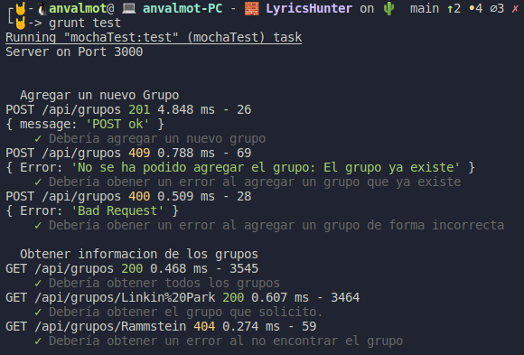

## Uso de buenas prácticas: configuración distribuida, logs

<!--  -->

- [Uso de buenas prácticas: configuración distribuida, logs](#uso-de-buenas-prácticas-configuración-distribuida-logs)
  - [Configuración distribuida](#configuración-distribuida)
  - [Logs](#logs)
  - [Otros](#otros)
  - [Referencias:](#referencias)

### Configuración distribuida

Siguiendo con las buenas prácticas, vamos a configurar nuestro servidor para que utilice un servicio de configuración distribuida. 

Este servicio de configuración distribuida será [Etcd3](https://www.npmjs.com/package/etcd3).

Para utilizarlo, lo primero es instalar la biblioteca de node que es capaz de utilizar este servicio. Para ello ejecutamos:

`npm install --save etcd3`

Una vez instalado, en nuestro fichero [index.js](../../src/index.js), debemos cargarlo y utilizarlo:

```javascript
const express = require('express');
const app = express();
const morgan = require('morgan');

const { Etcd3 } = require("etcd3");
const client = new Etcd3();

async function getPort() {
  const port = await client.get("LyricsHunterPort");
  return port;
}

// Settings
app.set('json spaces', 2);

// Middlerwares
app.use(morgan('dev'));
app.use(express.urlencoded({extended:false}));
app.use(express.json());

// Routes
app.use(require("./routes/grupos"));

//Starting the server
let PORT;
(async () => {
  PORT = await getPort();  
})()
  .then(() => {
    app.set("port", PORT || process.env.PORT || 3000);    
    app.listen(app.get("port"), () => {
      console.log(`Server on port ${app.get("port")}`);
    });
  }).catch(() => {
    app.set("port", PORT || process.env.PORT || 3000);
    app.listen(app.get("port"), () => {
      console.log(`Server on port ${app.get("port")}`);
    });
  });

module.exports = app;
```
Como se ha podido comprobar lo primero que hay que hacer es cargarlo:

```javascript
const { Etcd3 } = require("etcd3");
const client = new Etcd3();
```

Seguidamente, lo configuramos para que obtenga el puerto que previamente definiremos.

```javascript
async function getPort() {
  const port = await client.get("LyricsHunterPort");
  return port;
}
```

Finalmente, si se ha indicado ese puerto, al que hemos llamado `LyricsHunterPort` en Etcd3, lo almacenamos y si no damos un valor por defecto y ejecutamos el servidor en dicho servicio.  

```javascript
//Starting the server
let PORT;
(async () => {
  PORT = await getPort();  
})()
  .then(() => {
    app.set("port", PORT || process.env.PORT || 3000);    
    app.listen(app.get("port"), () => {
      console.log(`Server on port ${app.get("port")}`);
    });
  }).catch(() => {
    app.set("port", PORT || process.env.PORT || 3000);
    app.listen(app.get("port"), () => {
      console.log(`Server on port ${app.get("port")}`);
    });
  });
```

### Logs
Siguiendo con las buenas prácticas, vamos a configurar nuestro servidor para que utilice un logger. 

Este logger en mi caso  será [Morgan](https://github.com/expressjs/morgan). Morgan es un middleware capaz de procesar las solicitudes HTTP antes de que lleguen al servidor y loggearlas.

Para utilizarlo, lo primero es instalar la biblioteca de node que es capaz de utilizarlo. Para ello ejecutamos:

`npm install --save morgan`

Una vez instalado, lo cargamos en el fichero [index.js](../../src/index.js).

```javascript
const morgan = require('morgan');
```
Una vez cargado, debemos indicarle que se ejecute.

```javascript
// Middlerwares
app.use(morgan('dev'))
```

Como se puede ver, debemos indicarle el formato en el que queremos que nos muestre la información. 

- skip
- stream
- combined
- common
- dev
- short
- tiny

En mi caso he utilizado el formato `dev`, debido que me parece un formato que ofrece la información de una forma concisa y en el que se destaca de otro color el código de estado de la respuesta HTTP.

`:method :url :status :response-time ms - :res[content-length]`

:status será de color verde para los códigos de éxito, rojo para los códigos de error del servidor, amarillo para los códigos de error del cliente, cian para los códigos de redirección y sin color para los códigos de información.

Se puede comprobar su funcionamiento en la siguiente captura, la cual se realizó tras la ejecución de los test de las rutas:



### Otros

Aunque para este hito no era necesario tener ejecutando nuestro microservicio, he considerado que resultaría muy útil de cara a posteriores entregas hacer uso de la biblioteca [Nodemon](https://www.npmjs.com/package/nodemon)

Nodemon es una herramienta que ayuda a desarrollar aplicaciones basadas en node.js al reiniciar automáticamente la aplicación de nodo cuando se detectan cambios de archivo en el directorio.

Para instalarlo, debemos ejecutar el siguiente comando:

`npm install --save-dev nodemon`

A continuación creamos un script en nuestro [package.json](../../package.json).

```json
"dev": "nodemon src/index.js"
```

Finalmente, solo tendremos que ejecutar el siguiente comando para que se ejecute:

`npm run dev`

Dado que nuestro gestor de tareas es Grunt, vamos a utilizar el plugging que tiene Grunt para ejecutar Nodemon.

Para ello instalamos:

`npm install grunt-nodemon --save-dev`

y agregamos lo siguiente a nuestro [Gruntfile.js](../../Gruntfile.js).

```json
nodemon: {
      dev: {
        script: "src/index.js",
      },
    }
...
grunt.loadNpmTasks("grunt-nodemon");
grunt.registerTask("dev", ["nodemon"]);
```
De esta forma lo tendremos funcionando tal y como se ve en la siguiente imagen:


---
### Referencias:

[etcd3](https://www.npmjs.com/package/etcd3)

[How to Install etcd on Ubuntu](https://computingforgeeks.com/how-to-install-etcd-on-ubuntu-18-04-ubuntu-16-04/)

[expressjs/morgan](https://github.com/expressjs/morgan)

[morgan](https://www.npmjs.com/package/morgan)

[node Express.js and Morgan loggig](https://documentation.solarwinds.com/en/Success_Center/loggly/Content/admin/node-express-js-morgan-logging.htm#Node-Express-js-and-Morgan-logging)

[nodemon](https://www.npmjs.com/package/nodemon)
