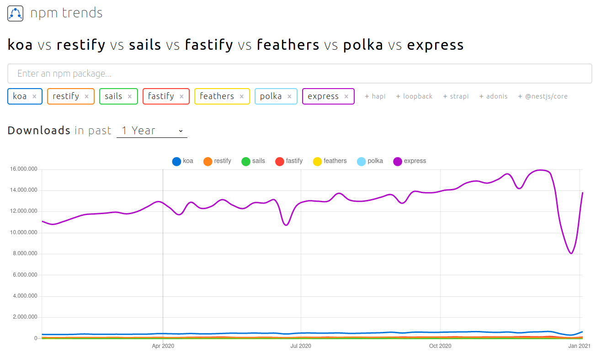
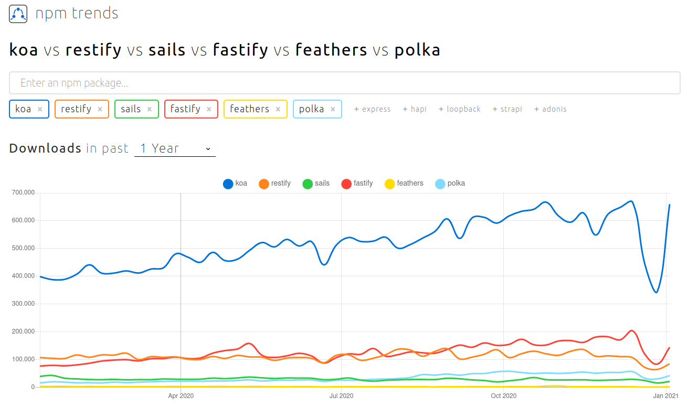
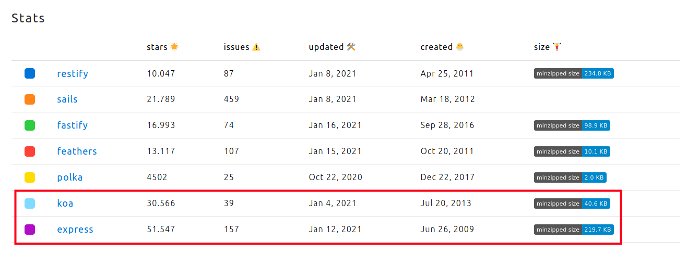
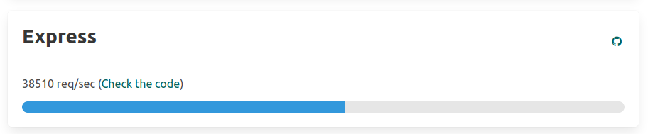
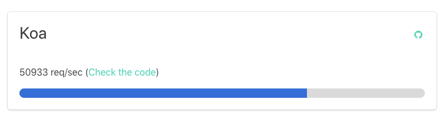
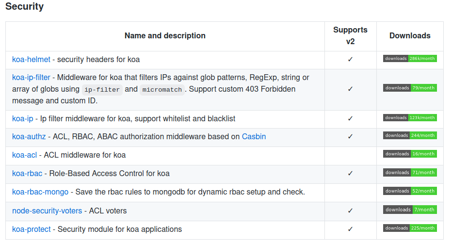

## Justificación técnica del framework elegido para el microservicio

<!--  -->

- [Justificación técnica del framework elegido para el microservicio](#justificación-técnica-del-framework-elegido-para-el-microservicio)
    - [Elección](#elección)
      - [Alternativas](#alternativas)
      - [Express](#express)
      - [koa](#koa)
      - [Decisión final](#decisión-final)
    - [Justificación técnica](#justificación-técnica)
    - [Referencias:](#referencias)


#### Elección

A la hora de decidir el framework más adecuado para mi proyecto, lo primero que he hecho ha sido investigar un poco y he podido comprobar que para un proyecto en Node.js como es mi caso la opción más utilizada sería [Express](https://expressjs.com/es/). Sin embargo, hay más opciones, por tanto, vamos a ver algunas de ellas y escoger la mejor para nuestro proyecto.

##### Alternativas


En primer lugar vamos a visitar [npm trends](https://www.npmtrends.com/koa-vs-restify-vs-sails-vs-fastify-vs-feathers-vs-polka-vs-express) y a ver que alternativas a Express tenemos y cual es la más usada.



En la imagen anterior podemos ver, que efectivamente, indiscutiblemente el framework más utilizado durante el último año, es Express. Por tanto, vamos a quitarlo de la comprobación y ver cuál es el siguiente más utilizado.



Como se ha podido ver en la imagen anterior, la opción más utilizada después de Express es el framework [Koa](https://koajs.com/), seguido por [fastify](https://www.fastify.io/).

En la siguiente imagen podemos ver que tanto Express como Koa, son los que más estrellas tienen y que además han sido recientemente actualizadas.



Por tanto, según lo anterior, centraremos nuestra atención en estos dos framewoks. La elección finalmente se llevará a cabo en base a los siguientes criterios:

- Popularidad
- Instalación
- Facilidad de uso
- Experiencia previa
- Ventajas y Desventajas
- Rendimiento
- Seguridad
- Participación de la comunidad.

##### Express

Express es un framework mínimo y flexible que proporciona un conjunto sólido de características para aplicaciones web y móviles, se comporta como un middleware para ayudar a administrar servidores y rutas.

- **Popularidad**

Como se ha comprobado anteriormente, a día de hoy es el framework más popular con más de 50.000 estrellas en github.

- **Instalación**
  
En cuanto a la instalación, es muy sencilla, podemos instalarlo simplemente usando el siguiente comando:

`npm install express --save`

- **Facilidad de uso**

Resulta muy sencillo de utilizar, a continuación, podemos ver cómo se usa simplemente con un ejemplo sencillo de hola mundo:

```javascript
const express = require('express')
const app = express()
const port = 3000
// Cualquier otra ruta el servidor responderá con un 404 Not Found
app.get('/', (req, res) => res.send('Hello World!'))

app.listen(port, () => console.log(`Example app listening on port ${port}!`))
```
- **Experiencia previa**

Dado que poseo alguna experiencia usando express, será un punto a favor de este framework. Se puede ver un proyecto en el que lo utilizo desde este [enlace](https://github.com/AngelValera/CC2021-Ejercicios/tree/main/Ejercicios/src/Tema6/Api/src).
 
- **Ventajas y Desventajas**

En cuanto a las ventajas y desventajas que express presenta:

| Ventajas |Desventajas   |
|--|--|
|Casi el estándar para el middleware web Node.jsCurva de aprendizaje baja|La organización debe ser muy clara para evitar problemas al mantener el código  |
|Simple, minimalista, flexible y escalable  |A medida que aumenta el tamaño de su base de código, la refactorización se vuelve muy desafiante  |
|Desarrollo rápido de aplicaciones  |Se requiere mucho trabajo manual, ya que debe crear todos los puntos finales  |
|Totalmente personalizable|Resulta más pesado que el resto  |
|Fácil integración de middleware y servicios de terceros  |  |
|Se centra principalmente en los navegadores, lo que hace que la creación de plantillas y el renderizado sean una función casi lista para usar  |  |

- **Rendimiento**

En cuanto al rendimiento que express presenta, podemos tener en cuenta  los siguientes aspectos de cara a mejorarlo:

- Utilizar la compresión gzip.
- No utilizar funciones síncronas.
- Manejar las excepciones correctamente, usando try-catch.
- Ejecutar la aplicación en un clúster. Puede aumentar el rendimiento de una aplicación Node.js en gran medida al iniciar un grupo de procesos (un grupo ejecuta varias instancias de la aplicación, distribuyendo la carga y las tareas entre las instancias).
- Almacenar en caché los resultados de la solicitud, de modo que su aplicación no repita la operación para atender la misma solicitud repetidamente.
- Utilizar un equilibrador de carga para ejecutar varias instancias y distribuir el tráfico, como Nginx o HAProxy.

Como podemos ver, en la web de [Fastify](https://www.fastify.io/benchmarks/) se realizaron una serie de benchmark en la que se comparaban los resultados obtenidos de los frameworks más populares.

El resultado de ejecutar un programa sencillo como el ejemplo anterior en Express, obtuvo el siguiente resultado:



- **Seguridad**

Podemos encontrar una lista de actualizaciones de seguridad de Express en el siguiente [enlace](https://jhh66tnuan4axah6vyxsehhvbe--expressjs-com.translate.goog/en/advanced/security-updates.html). Por lo que podemos omprobar que es algo que se toman en serio.

Las vulnerabilidades de Node.js afectan directamente a Express, por lo que es importante estar atento a las vulnerabilidades de Node.js y asegurarse de que está utilizando la última versión estable de Node.js.

- **Participación de la comunidad**

En cuanto a la comunidad que presenta Express, podemos ver que se trata de una comunidad activa que está en constante comunicación y realizando actualizaciones. 

Cuenta con más de 2000 usuarios y se comunican a través de su lista de correo, Gitter, canal IRC, issues en GitHub y Express Wiki.


##### koa

Koa fue creado por el mismo equipo detrás de Express y tiene como objetivo ser una base más pequeña, más expresiva y más sólida para aplicaciones web y API. Al aprovechar las funciones asincrónicas, Koa le permite deshacerse de los callbacks y aumentar significativamente el manejo de errores. Koa no incluye ningún middleware dentro de su núcleo y proporciona un elegante conjunto de métodos que hacen que los servidores de escritura sean rápidos y agradables.

- **Popularidad**

Como se ha comprobado anteriormente, a día de hoy es el framework más popular después de Express con más de 30.000 estrellas en github.

- **Instalación**

En cuanto a la instalación, Koa requiere el nodo v7.6.0 o superior para ES2015 y compatibilidad con funciones asíncronas. 

`nvm install 7`
`npm i koa`
`node my-koa-app.js`
  

- **Facilidad de uso**

Vamos a crear el mismo ejemplo que hicimos anteriormente en express, pero usando Koa:

```javascript
const Koa = require('koa');
const app = new Koa();
// Cualquier otra ruta el servidor responderá con un 404 Not Found
app.use(async ctx => {
  ctx.body = 'Hello World';
});

app.listen(3000);
```

- **Experiencia previa**

En este caso, no poseo experiencia previa usando este Framework.
 
- **Ventajas y Desventajas**

En cuanto a las ventajas y desventajas que express presenta:

| Ventajas |Desventajas   |
|--|--|
|Koa mejora la interoperabilidad, la solidez y hace que la escritura de middleware sea mucho más agradable  |La comunidad de código abierto alrededor de Koa es relativamente pequeña  |
| Tiene una gran cantidad de métodos útiles pero mantiene una huella pequeña, ya que no se incluye middleware |No es compatible con middleware de estilo Express  |
|Tiene una experiencia de usuario muy buena  |Koa utiliza generadores que no son compatibles con ningún otro tipo de middleware de framework Node.js  |
|Mejor manejo de errores mediante try / catch  |  |
|Flujo de control basado en generación  |  |
|No más devoluciones de llamada, lo que facilita un flujo de control ascendente y descendente  |  |
|Código asincrónico más limpio y legible  |  |

- **Rendimiento**

Con Koa se pueden crear aplicaciones web con un gran rendimiento. Esto es debido a que puede dejar de usar callbacks, lidiar con errores más rápido y porque Koa en sí, es un marco muy ligero. Además, facilita el proceso de gestión del código.

Es importante tener en cuenta las mejores prácticas para tener un mejor rendimiento en Node.js:
- Ejecutar en paralelo.
- Usar API asincrónicas en su código
- Mantener el código pequeño y ligero 
- Usar la compresión gzip.

Al igual que en el caso anterior, en la web de [Fastify](https://www.fastify.io/benchmarks/), podemos ver el resultado de ejecutar un programa sencillo como el anterior usando Koa.



- **Seguridad**

Existen diferentes middlewares y encabezados para Koa que ayudan a mejorar la seguridad, podemos encontrarlos en el siguiente [enlace](https://github.com/koajs/koa/wiki#security)



- **Participación de la comunidad**

En cuanto a la comunidad, vimos anteriormente que a pesar de ser una comunidad relativamente pequeña (desde luego mucho más pequeña que la de express), también realizan actualizaciones contínuamente.

##### Decisión final

Finalmente, después de probar ambos frameworks, y teniendo en cuenta todo lo anterior, he decidido usar **Express** como framewok para desarrollar mi microservicio.

Considero que aunque, Koa, resulta fácil de usar y es más ligero que express, no puede competir con la popularidad de express y la gran comunidad que posee. Además, contar con experiencia previa en este framework también ha influido en la decisión.

#### Justificación técnica

Una vez que hemos elegido el framework a utilizar, vamos a proceder a justificar su uso.

El primer paso es instalarlo usando el comando que indicamos anteriormente.

`npm install express --save`

Una vez instalado, vamos a crearnos el fichero principal desde donde ejecutaremos express.

En el directorio `/src` he creado el siguiente fichero [index.js](../../src/index.js)

```javascript
const express = require('express');
const app = express();
const morgan = require('morgan');

// Settings
app.set('port', process.env.PORT || 3000);
app.set('json spaces', 2);

// Middlerwares
app.use(morgan('dev'));
app.use(express.urlencoded({extended:false}));
app.use(express.json());

// Routes
app.use("/api",require("./routes/grupos"));

// Starting the server
app.listen(app.get('port'), () => {
    console.log(`Server on Port ${app.get("port")}`);
});

module.exports = app;
```
Como se puede ver en este fichero, lo primero ha sido cargar las bibliotecas de express y morgan (cuya finalidad se desarrolla en el siguiente [fichero](./buenasPracticas.md)).

Una vez cargadas establecemos un puerto para servir el microservicio. En este [fichero](./buenasPracticas.md) se explica cómo se ha utilizado etc3 para establecer de una mejor forma el puerto en el que se ejecuta el servidor.

En el siguiente apartado, hemos realizado algunas configuraciones para que se apliquen antes de procesar la respuesta. Siendo una de estas la indicación de que vamos a trabajar sobre todo con formatos json.

En el siguiente apartado es donde indicamos a express dónde se han guardado las rutas que tiene que servir. Además indicamos un "prefijo" a las rutas ahi contenidas. Cómo se han desarrollado estas rutas y la estructura general del API se puede encontrar en este [fichero](./diseñoApi.md).

Finalmente, ejecutamos el servidor en el puerto seleccionado anteriormente.


---
#### Referencias:

[Express](https://expressjs.com/es/)

[npm trends Frameworks](https://www.npmtrends.com/koa-vs-restify-vs-sails-vs-fastify-vs-feathers-vs-polka-vs-express)

[Koa](https://koajs.com/)

[Fastify](https://www.fastify.io/)

[Choosing the right Node.js Framework](https://nodesource.com/blog/Express-Koa-Hapi)

[Fastify Benchmarks](https://www.fastify.io/benchmarks/)

[koajs/Koa](https://github.com/koajs/koa)

[Koa. js - Guía rápida](https://www.hebergementwebs.com/tutorial-de-koajs/koa-js-guia-rapida)

[morgan](https://www.npmjs.com/package/morgan)