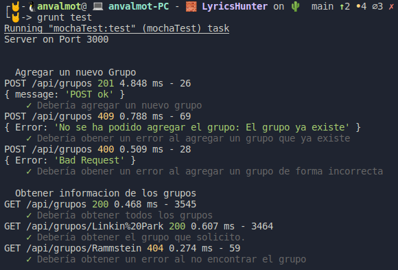

## Tests correctos y de acuerdo con las historias de usuario

<!--  -->
- [Tests correctos y de acuerdo con las historias de usuario](#tests-correctos-y-de-acuerdo-con-las-historias-de-usuario)
    - [Biblioteca para test](#biblioteca-para-test)
    - [Test de las rutas](#test-de-las-rutas)
      - [Grupos](#grupos)
    - [Referencias:](#referencias)

#### Biblioteca para test

A la hora de testear las rutas diseñadas para nuestro microservicio, de igual manera que para testear la aplicación necesitamos usar una biblioteca específica. Dado que anteriormente ya habíamos seleccionado [Chai](chaijs.com), vamos a utilizar su extensión  [Chai HTTP]() que permite realizar pruebas de integración con llamadas HTTP utilizando las aserciones de CHAI y todos los métodos de HTTP: GET, POST, PUT, DELETE, PATCH…

Para instalar Chai HTTP, solamente debemos ejecutar:

`npm install chai-http`

y para ejecutarla solamente debemos indicarlo, como cualquier otro pluging de Chai.

```javascript
var chai = require('chai')
  , chaiHttp = require('chai-http');

chai.use(chaiHttp);
```

#### Test de las rutas

Una vez instalada la extensión, vamos a ejecutar varios test a las distintas rutas que definimos.

##### Grupos

Para testear las rutas relativas a la entidad Grupos de musica, se ha creado un nuevo fichero de test, llamado [api.grupos.test.js](../../test.grupos.test.js)

Dado que en fichero [grupos.js](../../src/routes/grupos.js), definimos 3 rutas, vamos a probar que efectivamente dichas rutas funcionan correctamente. Con el fin de facilitar la labor de testeo de las rutas he creado un fichero [sample.json](../../test/sample.json) con varios grupos de música definidos.

- `POST: /grupos` 
  - Esta ruta se ha creado en respuesta a la [[HU10] Agregar nuevos Grupos de musica](https://github.com/AngelValera/LyricsHunter/issues/66).

```javascript
// [HU10] Agregar nuevos Grupos de música 
describe("Agregar un nuevo Grupo ", () => {
  it("Debería agregar un nuevo grupo", (done) => {
    chai
      .request(app)
      .post("/grupos")
      .send(groupSamples[0])
      .end(function (err, res) {
        console.log(res.body);
        expect(res).to.have.status(201);
        done();
      });
  });

  it("Debería obener un error al agregar un grupo que ya existe", (done) => {
    chai
      .request(app)
      .post("/grupos")
      .send(groupSamples[0])
      .end(function (err, res) {
        console.log(res.body);
        expect(res).to.have.status(409);
        done();
      });
  });

  it("Debería obener un error al agregar un grupo de forma incorrecta", (done) => {
    chai
      .request(app)
      .post("/grupos")
      .send({
        nombre: "Rammstein",
        anioFormacion: 1994,
        anioSeparacion: null,
        estilo: "Metal",
      })
      .end(function (err, res) {
        console.log(res.body);
        expect(res).to.have.status(400);
        done();
      });
  });
});
```
Como se ha podido ver, se comprueba que:
    - Si un grupo se crea correctamente la petición devuelve un código **201**.
    - Si se intenta crear un grupo que ya existe, devuelve un código **409**
    - Si se realiza una petición con un formato erróneo devuelve un código **400**.


- `GET /grupos` y `GET /grupos/:nombre`
  - Estas rutas se ha creado en respuesta a la [[HU1] Consultar información de un grupo de música](https://github.com/AngelValera/LyricsHunter/issues/12).

```javascript
// [HU1] Consultar información de un grupo de música
describe("Obtener informacion de los grupos", () => {  
  it("Debería obtener todos los grupos", (done) => {
    chai
      .request(app)
      .get("/grupos")
      .end(function (err, res) {
        expect(res).to.have.status(200);
        done();
      });
  });

  it("Debería obtener el grupo que solicito.", (done) => {
    chai
      .request(app)
      .get("/grupos/Linkin Park")
      .end(function (err, res) {
        expect(res).to.have.status(200);
        done();
      });
  });

  it("Debería obtener un error al no encontrar el grupo", (done) => {
    chai
      .request(app)
      .get("/grupos/Rammstein")
      .end(function (err, res) {
        expect(res).to.have.status(404);
        done();
      });
  });
});
```
Como se ha podido ver, se comprueba que:
    - Si se realiza una petición para obtener todos los grupos, se recibe un código **200**.
    - Si se realiza una petición de un grupo de música que existe indicando el nombre como parámetro, se recibe un código **200**.
    - Si se realiza una petición de un grupo que no existe indicando el nombre como parámetro, se recibe un código **404**.

En la siguiente captura se puede ver el resultado de la ejecución de los test anteriores.



---
#### Referencias:

[Testeo de API REST con Mocha y Chai-HTTP](https://www.paradigmadigital.com/dev/testeo-api-rest-mocha-chai-http/)

[Chai Assertion Library](https://www.chaijs.com/)

[Test a simple express app: Uncaught ReferenceError: done is not defined](https://stackoverflow.com/questions/55930430/test-a-simple-express-app-uncaught-referenceerror-done-is-not-defined)

[Chai](chaijs.com)

[Chai HTTP](https://www.chaijs.com/plugins/chai-http/)

