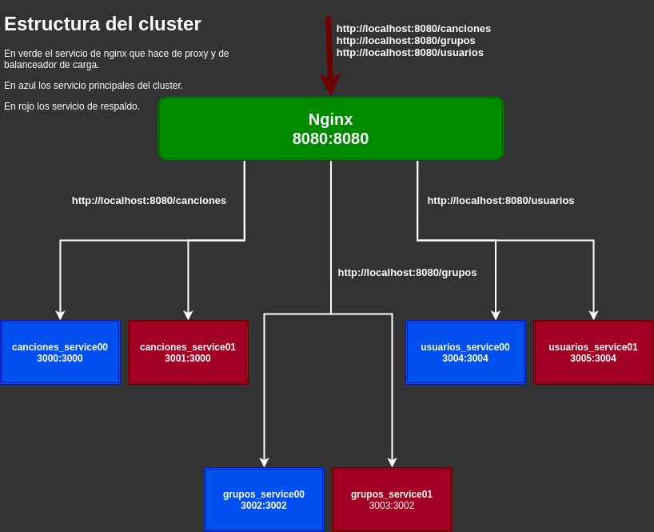

## Documentación y justificación de la configuración de cada uno de los contenedores del cluster

<!--  -->

- [Documentación y justificación de la configuración de cada uno de los contenedores del cluster](#documentación-y-justificación-de-la-configuración-de-cada-uno-de-los-contenedores-del-cluster)
  - [Servicio Nginx](#servicio-nginx)
  - [Servicios Canciones, Grupos y Usuarios](#servicios-canciones-grupos-y-usuarios)
  - [Referencias:](#referencias)

Según lo descrito en el [documento](./EstructuraCluster.md), nuestro clúster se ha definido de la siguiente manera:



Como se puede ver, se han utilizado 7 servicios, aunque 3 de ellos son réplicas, por lo que realmente usamos sólo 4, los cuales vamos a explicar a continuación:

### Servicio Nginx

Para este servicio, se ha utilizado la imagen `nginx:alpine` ya que como vimos en su día, resulta la más ligera.
Lo más importante de este servicio, es cómo pasarle el fichero de [configuración](../../Config/nginx/conf.d/nginx.conf), el cual se puede ver a continuación:

```conf
upstream lh_canciones {  
    ip_hash;          
    server canciones_service00:3000 weight=2;	
    server canciones_service01:3000 weight=1;
}
upstream lh_grupos {  
    ip_hash;
    server grupos_service00:3002 weight=2;	
    server grupos_service01:3002 weight=1;    
}
upstream lh_usuarios {   
    ip_hash;
    server usuarios_service00:3004 weight=2;	
    server usuarios_service01:3004 weight=1;  
}
server {
    listen 8080;
    server_name localhost;
    access_log /var/log/nginx/localhost.access.log;
    error_log /var/log/nginx/localhost.error.log;	           
    
    location /canciones {
        proxy_pass http://lh_canciones;
        proxy_set_header Host $host;
        proxy_set_header X-Real-IP $remote_addr;
        proxy_set_header X-Forwarded-For $proxy_add_x_forwarded_for;
        proxy_http_version 1.1;
        proxy_set_header Connection "";                    
    }

    location /grupos {
        proxy_pass http://lh_grupos;
        proxy_set_header Host $host;
        proxy_set_header X-Real-IP $remote_addr;
        proxy_set_header X-Forwarded-For $proxy_add_x_forwarded_for;
        proxy_http_version 1.1;
        proxy_set_header Connection "";                    
    }

    location /usuarios {
        proxy_pass http://lh_usuarios;
        proxy_set_header Host $host;
        proxy_set_header X-Real-IP $remote_addr;
        proxy_set_header X-Forwarded-For $proxy_add_x_forwarded_for;
        proxy_http_version 1.1;
        proxy_set_header Connection "";                    
    }
}
```

Como se puede ver, en primer lugar se han definido 3 grupos de 2 servidores cada uno, usando para ello `upstream`. Dentro de cada grupo, se han dado unos pesos y se ha indicado que el balanceo sea mediante `ip_hash`. Esto significa que nginx decidirá a qué servidor enviar la petición en función de la ip que la realice, de manera que a una misma ip casi siempre irá al mismo servidor, siempre que éste pueda procesar la petición.

Posteriormente, indicamos el nombre y el puerto que utilizará nginx, así como los ficheros de logs que queremos que utilice.

Finalmente, indicamos las redirecciones que nginx debe realizar a los grupos de servidores que anteriormente definimos. También podemos indicar información de la cabecera. De esta manera, nginx sabrá hacia donde debe enviar las peticiones que le lleguen.

### Servicios Canciones, Grupos y Usuarios

Dado que tanto los servicios de `canciones`, `grupos` y `usuarios` se han definido y creado de manera similar, vamos a explicar cómo se ha creado sólo uno de ellos.

En primer lugar, debemos crear el dockerfile que sea capaz de ejecutar el microservicio, por tanto, se han descrito 3 dockerfiles, los cuales son:

- [canciones.Dockerfile](../../canciones.Dockerfile)
- [grupos.Dockerfile](../../grupos.Dockerfile)
- [ususarios.Dockerfile](../../ususarios.Dockerfile)

Si vemos como se ha creado el dockerfile de canciones:

```Dockerfile
FROM node:15.2.1-alpine3.10

LABEL maintainer = "Ángel Valera Motos" \
    com.lyricshunter.version="0.0.1" \
    com.lyricshunter.release-date="2021-02-04" 

RUN mkdir -p /app/src && \       
    mkdir -p /app/node_modules && \
    chown -R node:node /app && \
    npm install -g grunt-cli 

WORKDIR /app

USER node 

COPY --chown=node:node ["package*.json", "Gruntfile.js",".jshintrc", "./"]

COPY --chown=node:node ["src/Canciones", "./src/Canciones"]

RUN npm install grunt-cli && grunt install

ENV PATH=/node_modules/.bin:$PATH

EXPOSE 3000

CMD [ "grunt", "start_canciones" ]
```
Vemos que se ha utilizado, la misma imagen que veníamos utilizando en entregas anteriores. 

Una vez creado el directorio `/src`, definimos el usuario node y copiamos sólamente los ficheros necesarios para levantar el microservicio, esto es el contenido del directorio `/Canciones`, `/Grupos` o `/usuarios` según el microservicio que sea. 

Finalmente, después de instalar las dependencias, establecemos el puerto correpondiente. En este caso, he decidido exponer un puerto distinto para cada microservicio, por tanto:

- Microservicio Canciones: puerto **3000**.
- Microservicio Grupos: puerto **3002**.
- Microservicio Usuarios: puerto **3004**.


Hay que destacar, que fue necesario definir una nueva tarea en el [Gruntfile](../../Gruntfile.js) para ejecutar cada uno de los microservicios por separado.

Además, también ha sido necesario, crear tanto un fichero de [configuración](../../src/Canciones/Config.js), como el [servidor](../../src/Canciones/server.js) y las [rutas](../../src/Canciones/routes/canciones.js) pertinentes dentro de cada microservicio.

El fichero de configuración es similar, salvo por el puerto por defecto.

En cuanto al fichero con el servidor, la única diferencia está en qué fichero de rutas debe utilizar y en qué variable debe leer de etcd si éste está ejecutándose.


---
### Referencias:

[Module ngx_http_upstream_module](http://nginx.org/en/docs/http/ngx_http_upstream_module.html#ip_hash)

[Nginx](http://nginx.org/)

[]()

[]()

[]()

[]()