## Despliegue en un servicio cloud

<!--  -->


### Servicio Cloud

Para poder desplegar nuestra composición de servicios en un servicio cloud, lo primero que debemos hacer es elegir el servicio que vamos a utilizar. 

En un principio, me decante por usar un PaaS como [Heroku](www.heroku.com), sin embargo, finalmente lo descarté ya que no fui capaz de desplegar la composición usando el docker-compose. Por lo que pude ver, podía haber subido y desplegado cada servicio por separado. Es por esta razón, por la que decidí usar un IaaS como podría ser AWS, Azure, Digital Ocean o Google Cloud.

Después de ver un poco por encima las posibilidades que tenía y los precios, recordé que actualmente, estaba en el periodo gratis de prueba de Google Cloud y que contaba con un crédito de 250 €, por lo que decidí usarlo.

### Despligue

Una vez decidido el servicio en el que iba a desplegar mi composición, el cual era [Google Cloud](https://cloud.google.com/), lo siguiente que vamos a hacer es explicar cómo se ha utilizado.

Lo primero que debemos hacer es acceder a la consola de Google Cloud.

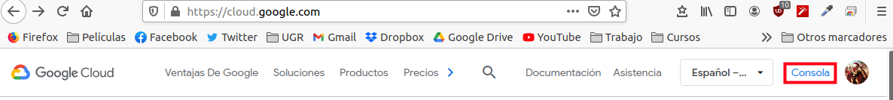


Una vez entro de la consola, crearemos un nuevo proyecto, en mi caso lo he llamado `lyricshunter` y lo seleccionaremos.


Una vez creado el proyecto, debemos hacer click en el `Menú de navegación` y acceder a `Compute engine`, se desplegará el menú de máquinas virtuales y seleccionaremos la  opción que dice `Instacias de VM`.

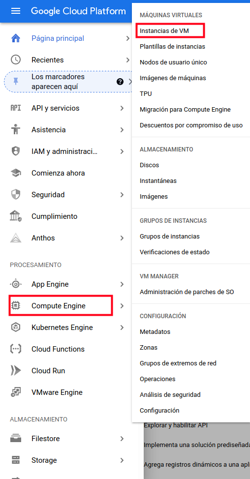

Una vez dentro, si no tenemos creada ninguna instancia anterior, haremos click en `crear` y ya accederíamos al menú para crear una nueva máquina virtual.

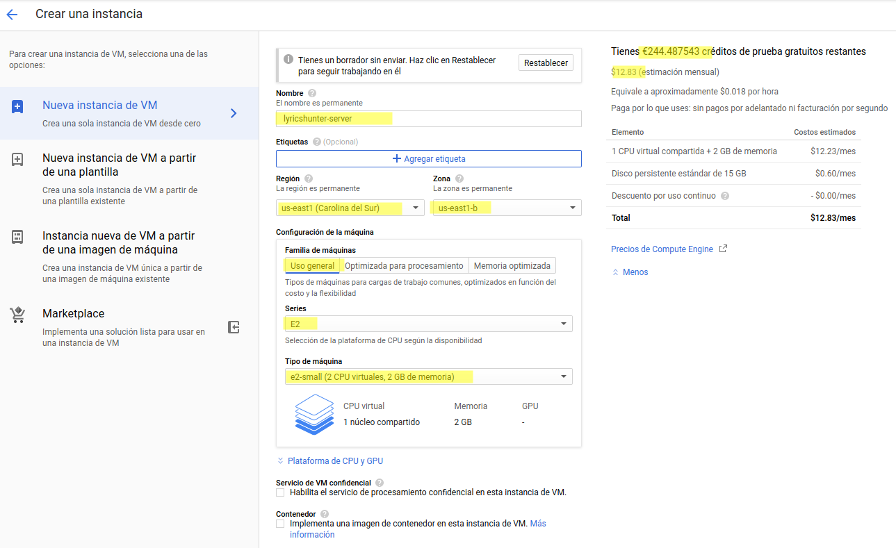

Como se puede ver en la imagen anterior, debemos indicar una serie de parámetros para poder crear la máuina a nuestro gusto. Cabe destacar que en función de los parámetros, se nos irá calculando el precio mensual que costará. 

En caso, tuve que hace uso de 2 CPUs y dos GB de memoria para poder ejecutar mi composición, ya que con una sola CPU no era suficiente y no desplegaba los servicios.

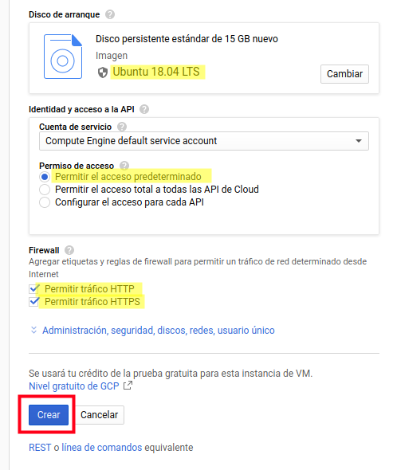

Otra cosa que debemos hacer es seleccionar el disco y el sistema operativo que queremos en la máquina. En mi caso he utilizado Ubuntu 18.04. Y por último, debemos indicarle que permita el tráfico HTTP y HTTPS.

Se podrían hacer una configuración más detallada de la máquina, pero en mi caso esto ha sido suficiente.

Como se puede ver en la siguiente captura, ya tendríamos la máquina creada y a la que podríamos acceder mediante SSH. 

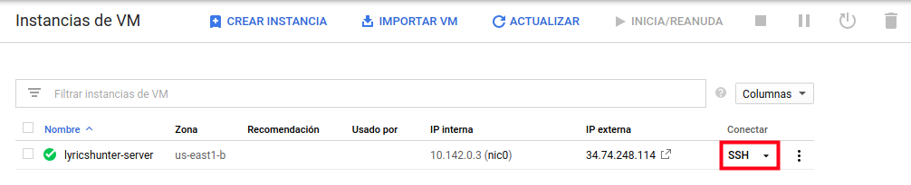

Si usamos Google Chrome como navegador, podríamos acceder directamente usando SSH, desde el navegador.

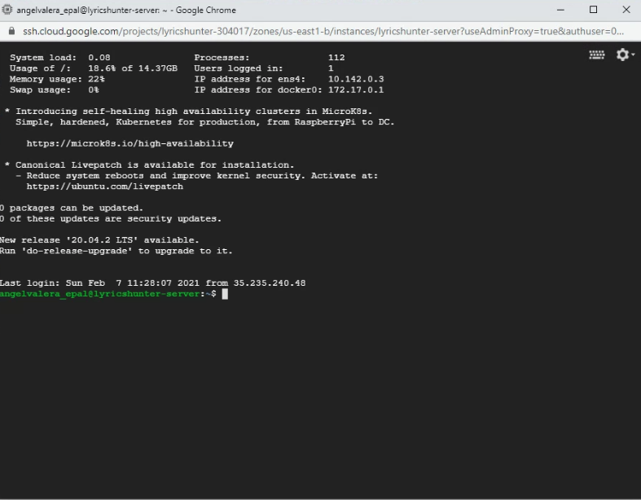

Una vez conectados a la máquina, debemos instalar tanto **Docker**, como **Docker-compose**. Una vez instalado, clonamos el repositorio del proyecto, accedemos al mismo y ejecutamos la composición.

La secuencia de comandos introducida sería la siguiente:

**Instalación de Docker**
```shell
sudo apt update
sudo apt upgrade
sudo apt-get install  curl apt-transport-https ca-certificates software-properties-common
curl -fsSL https://download.docker.com/linux/ubuntu/gpg | sudo apt-key add -
sudo add-apt-repository "deb [arch=amd64] https://download.docker.com/linux/ubuntu $(lsb_release -cs) stable"
sudo apt update
sudo apt install docker-ce
# Hacemos que Docker se ejecute sin permisos de administrador
# Es necesario reiniciar el sistema para que tenga efecto
sudo usermod -aG docker $(whoami)
```
**Instalación de Docker**
```shell
sudo curl -L https://github.com/docker/compose/releases/download/1.21.2/docker-compose-`uname -s`-`uname -m` -o /usr/local/bin/docker-compose
sudo chmod +x /usr/local/bin/docker-compose
docker-compose --version
```
**Clonación del repositorio**
```shell
git clone https://github.com/AngelValera/LyricsHunter.git
cd LyricsHunter/
docker-compose build
docker-compose up
```
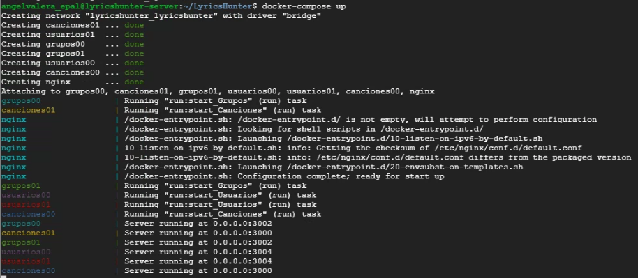

Aunque como se ha podido ver en la captura anterior, todos los servicios de la composición están funcionando, realmente faltaría configurar los puertos de la máquina para que estos servicios pudiesen recibir peticiones y dar respuesta.

Para configurar los puertos, debemos volver a Google Cloud y acceder a `Configura las reglas de firewall`.

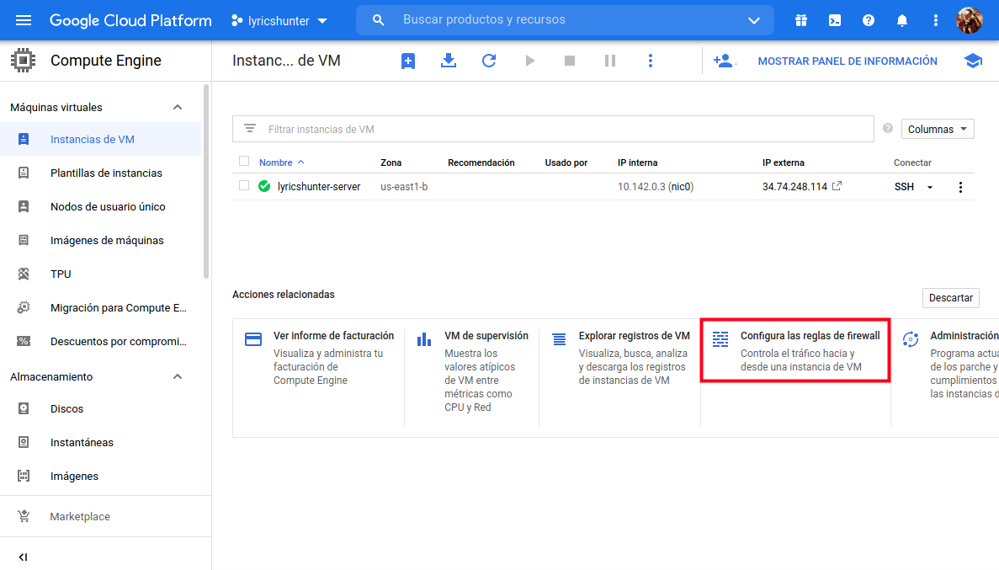

Una vez dentro, indicamos que queremos crear una nueva regla. En esta nueva regla, indicamos que abrimos el puerto de nuestro servicio que es el 8080.

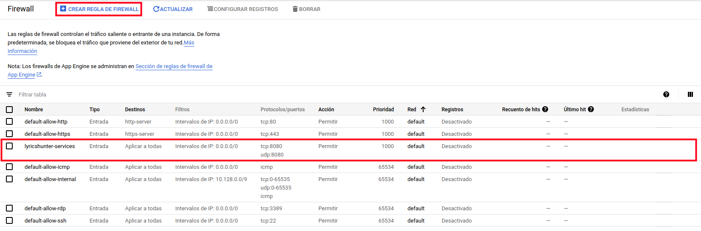

Hecho esto, el servicio ya recibiría las peticiones y les daría respuesta.


### Testeo

Para comprobar, que efectivamente el servicio está funcionando, vamos a realizar un par de peticiones usando Postman. Para ello usamos la ip que nos indica la máquina virtual, 34.74.248.114 y el puerto 8080:

[http://34.74.248.114:8080/canciones](http://34.74.248.114:8080/canciones)

[http://34.74.248.114:8080/grupos](http://34.74.248.114:8080/grupos)

[http://34.74.248.114:8080/usuarios](http://34.74.248.114:8080/usuarios)

Primero crearemos un nuevo grupo.

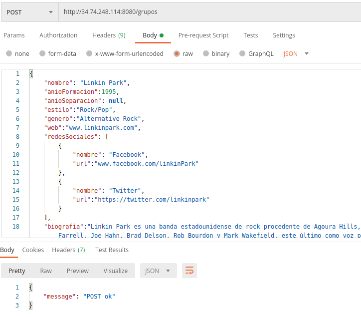

Ahora indicaremos que nos devuelva todos los grupos.

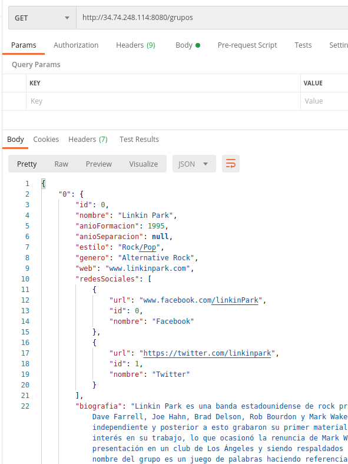

Como se puede ver, desde el servicio podemos comprobar que se están recibiendo las peticiones:

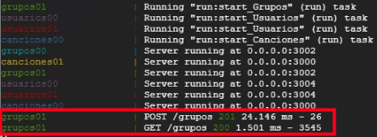

Finalmente, vamos a realizar una prueba de carga, y para ello haremos uso de la herramienta [Taurus](https://gettaurus.org/).

Para esta prueba se ha creado un fichero [pruebasTaurus.yml](../../pruebasTaurus.yml), en el que indicamos que testee, los tres servicios principales con una concurrencia de 750 durante 50s y en el que se indica como Timeout un periodo de 15 segundos.
```yml
execution:
- concurrency: 750
  ramp-up: 30s
  hold-for: 50s
  scenario: canciones

- concurrency: 750
  ramp-up: 30s
  hold-for: 50s
  scenario: grupos

- concurrency: 750
  ramp-up: 30s
  hold-for: 50s
  scenario: usuarios


scenarios:
  grupos:    
    default-address: http://34.74.248.114:8080
    timeout: 15s
    requests:
      - url: /grupos
        method: GET
        headers:
          Content-Type: application/json
  canciones:    
    default-address: http://34.74.248.114:8080
    timeout: 15s
    requests:
      - url: /canciones
        method: GET
        headers:
          Content-Type: application/json
  usuarios:    
    default-address: http://34.74.248.114:8080
    timeout: 15s
    requests:
      - url: /usuarios
        method: GET
        headers:
          Content-Type: application/json
```
A continuación, podemos ver el resultado de la prueba:

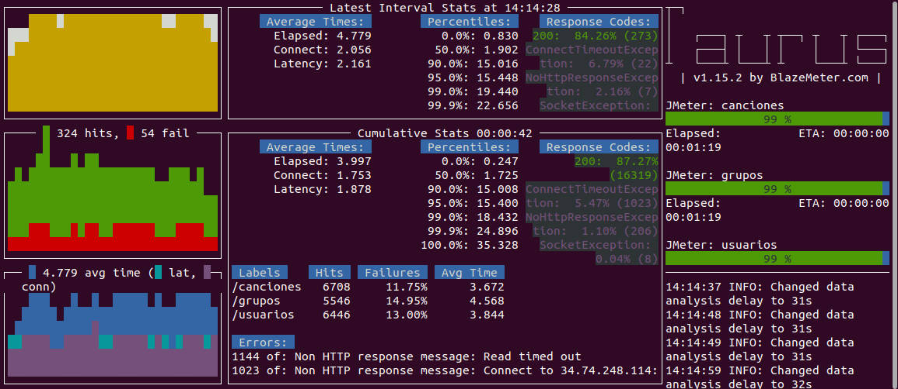


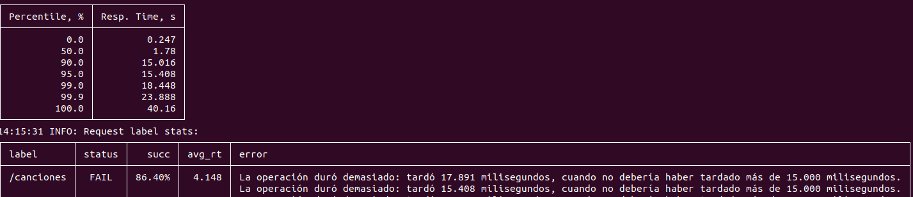

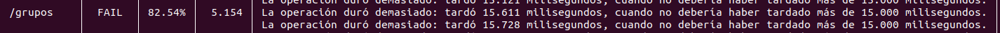

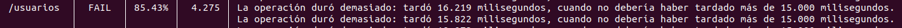

Como se ha podido ver, todos los servicios han respondido correctamente entorno al 85% de las veces.

---
### Referencias:

[Heroku](www.heroku.com)

[Taurus](https://gettaurus.org/)

[Google Cloud](https://cloud.google.com/)

