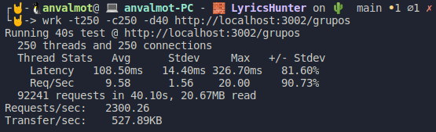

## Testeo de la composición

<!--  -->
- [Testeo de la composición](#testeo-de-la-composición)
  - [Testeo usando una Github Actions](#testeo-usando-una-github-actions)
  - [Realizando pruebas de rendimiento](#realizando-pruebas-de-rendimiento)
  - [Referencias:](#referencias)
  
### Testeo usando una Github Actions

Para testear la composición, lo primero que se hizo fue desarrollar una Github Action de manera que construya el cluster y realice una serie de peticiones. 

El [fichero](../../.github/workflows/tester-DockerCompose.yml) con la github action, se puede ver a continuación:
```yml
name: Comprobar que docker compose funciona
on: [push,pull_request]
jobs:
  test:
    runs-on: ubuntu-latest
    steps:
      - uses: actions/checkout@v2
      - name: Construye el cluster
        run: docker-compose up -d      
      - name: Testea el cluster separado
        run: |
          # Testeamos los dos servicios de canciones
          wget http://localhost:3000/canciones || exit 1
          wget http://localhost:3001/canciones || exit 1          
          # Testeamos los dos servicios de grupos
          wget http://localhost:3002/grupos || exit 1
          wget http://localhost:3003/grupos || exit 1
          # Testeamos los dos servicios de usuarios
          wget http://localhost:3004/usuarios || exit 1
          wget http://localhost:3005/usuarios || exit 1
      - name: Testea el cluster en conjunto
        run: |
          wget http://localhost:8080/grupos || exit 1
          wget http://localhost:8080/canciones || exit 1
          wget http://localhost:8080/usuarios || exit 1
```
En ese fichero, como se puede ver, lo primero que hacemos es constriur el cluster para después realizar una serie de peticiones. 

Estas peticiones, se realizan primero directamente a cada uno de los microservicios, tanto principales como de respaldo, por su puerto pertinente.

Finalmente, se realizan peticiones a cada uno de los recursos pero ahora a través del puerto 8080 que es en el que está escuchando nginx y éste se encargará de redireccionar al correspondiente servicio.


En un principio, también se probó a testear el servicio usando para ello Travis.ci, pero debido al tiempo que empleaba, decidí descartarlo. Se puede ver esta configuración en el siguiente [commit](https://github.com/AngelValera/LyricsHunter/blob/13f29ea48480d4d164ae4c80f5f79334d3760583/.travis.yml)

### Realizando pruebas de rendimiento

Una vez que tenemos el cluster construido y funcionando, vamos a realizar pruebas usando para ello **wrk**. 

Wrk nos permite realizar pruebas de rendimiento, usando diferentes hebras y además de establecer el número de configuraciones máximas o la duración de las pruebas.

Utilizaremos wrk de la siguiente forma:

- `wrk -t<num_hebras> -c<num_max_conex> -d<duracion> <url>`

Realizaremos pruebas directamente contra los servicios de manera individual y posteriormente, las realizaremos contra nginx. Usaremos como microservicio de ejemplo el microservicio de `Grupos`.

- **Primera Prueba**

En esta primera prueba ejecutaremos unas 2000 hebras con un máximo de 2000 conexiones durante 40 segundos contra el microservicio de Grupos:

`wrk -t2000 -c2000 -d40 http://localhost:3002/grupos`

 

`wrk -t2000 -c2000 -d40 http://localhost:8080/grupos`

 


- **Segunda Prueba**

En esta segunda prueba, ejecutaremos unas 1000 hebras con un máximo de 1000 conexiones durante 40 segundos contra el microservicio de Grupos:

`wrk -t1000 -c1000 -d40 http://localhost:3002/grupos`

 

`wrk -t1000 -c1000 -d40 http://localhost:8080/grupos`

 


- **Tercera Prueba**

En esta tercera prueba, ejecutaremos unas 500 hebras con un máximo de 500 conexiones durante 40 segundos contra el microservicio de Grupos:

`wrk -t500 -c500 -d40 http://localhost:3002/grupos`

 

`wrk -t500 -c500 -d40 http://localhost:8080/grupos`

 

- **Cuarta Prueba**

En esta cuarta prueba, ejecutaremos unas 250 hebras con un máximo de 250 conexiones durante 40 segundos contra el microservicio de Grupos:

`wrk -t250 -c250 -d40 http://localhost:3002/grupos`

 

`wrk -t250 -c250 -d40 http://localhost:8080/grupos`

 


Como se puede comprobar, los resultado que proporciona en la mayoría de los casos el servicio usando nginx como balanceador cuando hay mayor número de peticiones, el servicio responde mejor que si se realizan directamente contra el servicio.

---
### Referencias:

[Installing wrk on Linux](https://github.com/wg/wrk/wiki/Installing-Wrk-on-Linux)

[]()

[]()

[]()

[]()

[]()