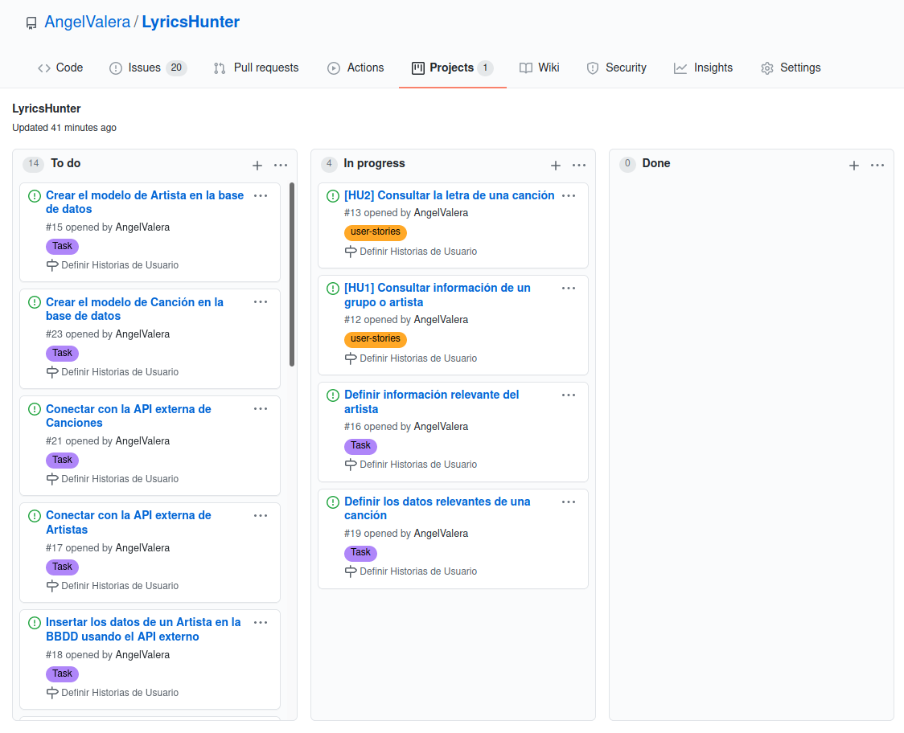

## Planificación del proyecto

En cuanto a la planificación del proyecto, lo que se ha hecho a sido definir cada una de las historias de usuario y de sus tareas pensando en el orden en el que se irán realizando.

Para esto, lo primero que se ha hecho a sido definir en la página de Github un project al que he llamado [LyricsHunter](https://github.com/AngelValera/LyricsHunter/projects/1) y al que se han incluido todos los issues que pertenecen tanto a historias de usuario como a tareas y se han colocado en la columna "To do" en orden de prioridad. 

De esta manera, el desarrollo de este proyecto se centrará primero en realizar tanto [HU1](ttps://github.com/AngelValera/LyricsHunter/issues/12) como [HU2](https://github.com/AngelValera/LyricsHunter/issues/13) junto con sus tareas y posteriormente se realizarán las demás en el siguiente orden, [HU3](https://github.com/AngelValera/LyricsHunter/issues/24), [HU4](https://github.com/AngelValera/LyricsHunter/issues/25), [HU5](https://github.com/AngelValera/LyricsHunter/issues/26) y [HU6](https://github.com/AngelValera/LyricsHunter/issues/28) junto a su tarea y finalmente [HU7](https://github.com/AngelValera/LyricsHunter/issues/29), [HU8](https://github.com/AngelValera/LyricsHunter/issues/30) y [HU9](https://github.com/AngelValera/LyricsHunter/issues/31).

El principal motivo de esta planificación, es porque las últimas historias de usuario necesitan que las primeras historias de usuario se hayan llevado a cabo para poder cumplirse.