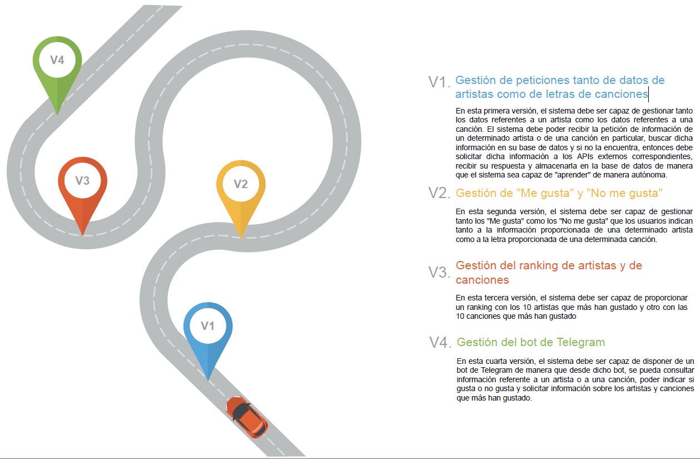

## Planificación del proyecto

En cuanto a la planificación del proyecto, lo que se ha hecho a sido definir una serie de historias de usuario, las cuales se han agrupado en cuatro milestones, de manera que para cada uno de ellos, tengamos una versión medianamente funcional del proyecto. 

### RoadMap

 [PowerPoint Presentation Template by HiSlide.io](https://www.hislide.io) 

#### Primera versión

Para esta primera versión lo que se pretende es tener un sistema que sea capaz de gestionar tanto los datos referentes a un artista como los datos referentes a una canción. El sistema debe poder recibir la petición de información de un determinado artista o de una canción en particular, buscar dicha información en su base de datos y si no la encuentra, entonces debe solicitar dicha información a los APIs externos correspondientes, recibir su respuesta y almacenarla en la base de datos de manera que el sistema sea capaz de "aprender" de manera autónoma.

Para llevarlo a cabo se han designado las siguientes de Historias de Usuario y de tareas.

* **[[M1] Gestión de peticiones tanto de datos de artistas como de letras de canciones](https://github.com/AngelValera/LyricsHunter/milestone/3)** 🏁
  * [[HU1] Consultar información de un grupo o artista](https://github.com/AngelValera/LyricsHunter/issues/12)
    * [Definir la estructura de datos que va a gestionar la información relevante de un artista ](https://github.com/AngelValera/LyricsHunter/issues/16)
    * [Crear el modelo de Artista en la base de datos](https://github.com/AngelValera/LyricsHunter/issues/15)
    * [Conectar con la API externa de Artistas](https://github.com/AngelValera/LyricsHunter/issues/17)
    * [Insertar los datos de un Artista en la BBDD usando el API externo](https://github.com/AngelValera/LyricsHunter/issues/18)
  * [[HU2] Consultar la letra de una canción](https://github.com/AngelValera/LyricsHunter/issues/13)
    * [Definir la estructura de datos para gestionar la información de una canción](https://github.com/AngelValera/LyricsHunter/issues/19)
    * [Crear el modelo de Canción en la base de datos](https://github.com/AngelValera/LyricsHunter/issues/23)
    * [Conectar con la API externa de Canciones](https://github.com/AngelValera/LyricsHunter/issues/21)
    * [Insertar los datos de una Canción en la BBDD usando el API externo](https://github.com/AngelValera/LyricsHunter/issues/22)
  * [[HU7] Recibir la biografía del artista al menos en dos idiomas](https://github.com/AngelValera/LyricsHunter/issues/29)

#### Segunda versión

En esta segunda versión, el sistema debe ser capaz de gestionar tanto los "Me gusta" como los "No me gusta" que los usuarios indican tanto a la información proporcionada de una determinado artista como a la letra proporcionada de una determinada canción.

Para llevarlo a cabo se han designado las siguientes de Historias de Usuario y de tareas.

* **[[M2] Gestión de "Me gusta" y "No me gusta" ](https://github.com/AngelValera/LyricsHunter/milestone/6)** 🏁
  * [[HU3] Indicar si gusta o no gusta la información de un artista](https://github.com/AngelValera/LyricsHunter/issues/24)
  * [[HU4] Indicar si gusta o no gusta la información de una canción](https://github.com/AngelValera/LyricsHunter/issues/25)

#### Tercera versión

En esta tercera versión, el sistema debe ser capaz de proporcionar un ranking con los 10 artistas que más han gustado y otro con las 10 canciones que más han gustado.

* **[[M3] Gestión del ranking de artistas y de canciones](https://github.com/AngelValera/LyricsHunter/milestone/7)** 🏁
  * [[HU5] Consultar los datos de un artista desde Telegram](https://github.com/AngelValera/LyricsHunter/issues/26)
    * [Definir un bot para Telegram](https://github.com/AngelValera/LyricsHunter/issues/27)
  * [[HU6] Consultar los datos de una canción desde Telegram](https://github.com/AngelValera/LyricsHunter/issues/28)
    * [Definir un bot para Telegram](https://github.com/AngelValera/LyricsHunter/issues/27)

#### Cuarta versión

En esta cuarta versión, el sistema debe ser capaz de disponer de un bot de Telegram de manera que desde dicho bot, se pueda consultar información referente a un artista o a una canción, poder indicar si gusta o no gusta y solicitar información sobre los artistas y canciones que más han gustado.

* **[[M4] Gestión del bot de Telegram](https://github.com/AngelValera/LyricsHunter/milestone/8)** 🏁 
  * [[HU8] Consultar los artistas mejor valorados](https://github.com/AngelValera/LyricsHunter/issues/30)
  * [[HU9] Consultar las canciones mejor valoradas](https://github.com/AngelValera/LyricsHunter/issues/31)

#### Adicional

Para ayudar a la hora de planificarse el trabajo se ha definido un [Projects](https://github.com/AngelValera/LyricsHunter/projects/1) desde github, de manera que se pueda ir marcando como pendientes, en desarrollo o completadas, tanto las tareas como las historias de usuario definidas.

