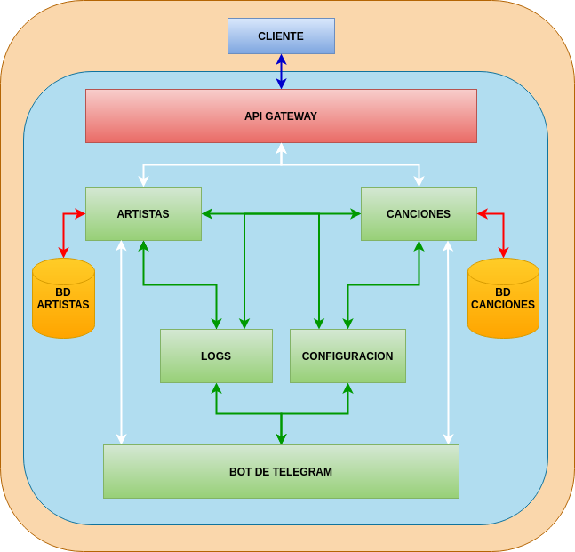

# LyricsHunter

En este repositorio se va a desarrollar un proyecto para la asignatura de Cloud Computing I impartida en el Máster de Ingeniería Informática de la Universidad de Granada durante el curso 2020-2021.

## Documentación

* [Configuración inicial del repositorio.](Doc/Configuracion_Inicial.md)
* [Descripción del problema a resolver.](Doc/Descripcion_Problema.md) 

## Definición de la Arquitectura

Después de informarme acerca de las arquitecturas existentes hoy día, he decidido que utilizar una arquitectura basada en microservicios, podría ser una buena opción para realizar este proyecto. El motivo es se basa principalmente en las ventajas que este tipo de arquitectura presenta. 

Este tipo de arquitectura nos permite la posibilidad de desarrollar los diversos microservicios de una forma independiente y además, podemos mantenerlos y actualizarlos de una manera mucho más simple que si usamos una arquitectura monolítica. 

Otro motivo por el que he decidido escoger este tipo de arquitectura, es porque si de entre todos los microservicios hubiese en alguno de ellos algún tipo de fallo que nos impidiese ejecutarlo, esto no afectaría al resto de microservicios. Del mismo modo, esto nos permitiría también añadir en un futuro más microservicios pudiendo integrarlos de manera independiente y aumentar así las funcionalidades del sistema.

#### Microservicios

1. El primer microservicio estará destinado a tratar con la información referente a un grupo de música o artista. Este microservicios se encargará de buscar esta información en una base de datos. Si esta información no se encontrase en dicha base de datos, el microservicio realizaría la misma petición a una [API externa](https://www.theaudiodb.com/api_guide.php) y si esta API si tuviese dicha información posteriormente se insertaría en la base de datos de manera que la próxima consulta ya no tendría que hacerla a la API y el micrservicio fuese "aprendiendo" con las consultas de los clientes.
2. El segundo microservicio se encargará de buscar información de una canción y principalmente de su letra. El proceso será similar al del microservicio anterior, la consulta se realizará a una base de datos y si esta no tuviese dicha información, realizaría la consulta a otra [API externa](https://lyricsovh.docs.apiary.io/#reference) y el resultado lo insertaría en la BBDD de manera que si se volviese a solicitar dicha información ya estaría registrada, de esta manera el microservicio irá "aprendiendo" de manera independiente.
3. El tercer microservicio se encargará de procesar las peticiones que se realices desde un bot de Telegram, de manera que el usuario pueda realizarle las consultas pertinentes desde dicho bot y este poder darle respuesta.
4. El cuarto servicio se trata de un servicio de loggin cuyo objetivo será monitorizar el sistema, almacenando para ello los registros de las actividades que se realizan dentro de cada uno de los otros microservicios y poder así analizar qué está ocurriendo en el sistema en cada momento y poder también, detectar los posibles errores que surjan. 
5. El quinto microservicio se encargará de almacenar todos los archivos de configuración relevantes y centralizar así en un único sistema toda la información necesaria para que los microservicios puedan comunicarse.

La arquitectura se puede ver en el siguiente esquema:

La comunicación como se puede ver en el esquema anterior se realizará mediante diversas API REST. El principal motivo de usar una API REST se fundamenta en que se encuentra entre una de las tecnologías más utilizadas para la gestión de peticiones a un servidor cuando se diseña un servicio web y su sencillez de uso.

### Definición de las herramientas

### Definición de las historias de usuario

